<div align="center">
<a id="up"></a>

English • [Español](doc/readme/i18n/README_ES.md) • [中文](doc/readme/i18n/README_ZH.md) • [日本語](doc/readme/i18n/README_JA.md) • [हिन्दी](doc/readme/i18n/README_HI.md)

</div>

<p align="center">
  <a href="https://inapp.bot">
    
  </a>
</p>

<h1 align="center">
  
</h1>

<h4 align="center">Virtual assistants that integrate across all platforms, improving the productivity of your apps.</h4>

<p align="center">
  
  <a href="https://github.com/Inappbot/inapp.bot/blob/main/LICENSE">
    
  </a>
  <a href="https://github.com/Inappbot/inapp.bot/stargazers">
    
  </a>
</p>

<p align="center">
    <a href="https://inapp.bot"><b>Website</b></a> •
    <a href="https://twitter.com/inappbot"><b>Twitter</b></a> •
    <a href="https://www.youtube.com/@inappbot"><b>Youtube</b></a>
</p>

<p align="center">
 <a href="https://www.youtube.com/watch?v=daEkkwFkm_Q">
  
    </a>
    
  > **InApp.Bot presentation at the Gemini API hackathon.**
</p>
<p align="center" style="margin-top: 5px;">
  <a href="https://www.youtube.com/watch?v=daEkkwFkm_Q">
    
  </a>
</p>

## 📖 Table of Contents

- [🚀 Quick Start](#-quick-start)
  - [Download the Playground](#download-the-playground)
  - [InApp.Bot v1.0.0](#inappbot-v100)
- [✨ Key Features](#key-features)
  - [Avatars: Bringing Your Assistant to Life](#avatars-bringing-the-assistant-to-life)
  - [Text-to-Speech: Giving Voice to Your Assistant](#text-to-speech-giving-voice-to-your-assistant)
  - [Admin Panel](#admin-panel-manage-your-assistants)
- [🧠 Assistant Modes](#assistant-modes-discover-the-power-of-each-mode)
  - [Data Plus Mode](#1-data-plus-mode)
  - [Index Mode](#2-index-mode)
  - [Scan AI Mode](#3-scan-ai-mode)
  - [Product Mode](#4-product-mode)
- [🌟 Additional Features](#other-features-of-inappbot-assistants)
- [🌐 Compatible Platforms](#where-inappbot-assistants-can-be-embedded)
- [⚙️ Installation Guides](#how-to-install-on-flutter-apps)
  - [Flutter Apps](#how-to-install-on-flutter-apps)
  - [iOS, Android, and Web Apps](#how-to-embed-in-ios-android-and-web-apps)
  - [Professional Installation Service](#installation-service-for-ai-assistants-in-your-projects)
  - [Installation for Developers](#installation-for-developers)
- [🤝 Contribute to the Project](#become-a-contributor-and-shape-the-future-of-inappbot)
- [🌱 Why Were Building InApp.Bot](#why-were-building-inappbot)
- [Roadmap](#roadmap)
- [Support](#support)
- [License](#license)


<a id="download-the-playground"></a>

## 🚀 Quick Start

### Download the Playground

<table>
  <tr>
    <th style=" color: black; text-align: center;">iOS</th>
    <th style=" color: black; text-align: center;">Android</th>
  </tr>
  <tr>
    <td align="center">
      <a href="https://apple.co/3NkCY4Y">
        
      </a>
    </td>
    <td align="center">
      <a href="https://bit.ly/3zQvrrE">
        
      </a>
    </td>
  </tr>
  <tr>
    <td align="center">📌 <em>Early access via TestFlight</em></td>
    <td align="center">📌 <em>Join our beta program</em></td>
  </tr>
</table>

<details>
<summary>📱 Quick Installation Guide</summary>

### iOS Setup

1. Tap the "Download on the App Store" button above.
2. You'll be redirected to TestFlight.
3. If not installed, download TestFlight from the App Store.
4. Accept the invitation to test our app.
5. Install and start your journey!

### Android Setup

1. Click the "Get it on Google Play" button.
2. You'll land on our Play Store listing.
3. Join the beta program (if available).
4. Install and dive in!

</details>

<a id="inappbot-v100"></a>

## inapp.bot v1.0.0

InAppBot is a cross-platform virtual assistant software that revolutionizes the way you interact with your users. This powerful assistant, designed to seamlessly integrate into Flutter, iOS, Android, and web applications, not only responds to user inquiries but also offers personalized recommendations and guides them in real-time, enhancing their experience and boosting your business efficiency. As an open-source solution, InAppBot not only allows you to customize every interaction but also gives you the freedom to tailor the assistant to the specific needs of your application.

<div align="center">
  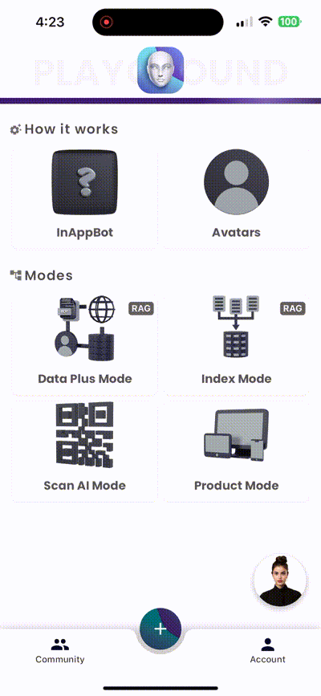
  <br>
  <em>inapp.bot assistant in flutter app</em>
</div>

> 👩‍💻 **We’ve created an assistant to give your apps superpowers!**


<details>
<summary><strong>🔍 Find out what this version offers!</strong></summary>

### **🤖 LLM by Gemini - Expanding Possibilities**

- **🚀Advanced AI:** Leverage the power of Google's Gemini for state-of-the-art language understanding and generation.
- 🔮 **Future-Proof:** Stay ahead of the curve with upcoming updates and enhanced AI capabilities.
- 🌐 **Multilingual Support:** Communicate effectively with users across different languages and cultures.

### **🚀 Vector Database by Pinecone**

- ⚡ **Lightning-Fast Retrieval:** Efficiently search and retrieve information from vast amounts of data.
- 🔍 **Semantic Search:** Understand user intent and provide more accurate and contextual responses.
- 📈 **Scalability:** Easily handle growing datasets without compromising on performance.

### **💾 Firebase Database**

- 🔐 **Secure & Scalable:** Firebase ensures your data is protected and scalable, allowing for easy management of large datasets without compromising security.
- ☁️ **Real-Time Sync:** Sync your data across platforms in real-time, providing a smooth experience for users regardless of device.
- 🛠️ **Developer-Friendly:** With Firebase’s intuitive setup, integrating databases into your project is fast and hassle-free.

### **📚 Knowledge Base by PDF, Web, and Text**

- 📊 **Diverse Sources:** Integrate information from various formats to create a comprehensive knowledge base.
- 🔄 **Easy Updates:** Quickly add or modify information to keep your assistant knowledge current.
- 🎯 **Targeted Learning:** Focus on specific domains or topics to make your assistant an expert in its field.

### **👤 Avatars by inapp.bot**

- 🌟 **Customizable Visuals:** Bring your assistant to life with customizable video avatars that reflect your brand and create a more engaging user experience.
- 👁️ **High-Quality Animations:** Use realistic video avatars to enhance interactions and foster stronger connections with users.
- 🎭 **Brand Identity:** Personalize avatars to match your project’s style, making your application truly unique.

### **🗣️ Text-to-Speech (TTS)**

- 💰 **Completely Free:** By utilizing the device's native TTS engine, there's no additional cost for speech synthesis.
- 🎧 **Device Integration:** Use the built-in TTS features for optimal performance without the need for external services.
- 🌐 **Multilingual Support:** Leverage the device's language settings to communicate in the user's preferred language.

### **🛠️ Admin Panel by inapp.bot**

- 🎛️ **Full Control:** Manage every aspect of your project through a streamlined admin panel, from data handling to user interactions.
- 🚀 **User-Friendly Interface:** Designed with ease-of-use in mind, enabling you to make updates and changes quickly.
- 🖥️ **Settings Control:** Customize settings and preferences from a central location.

</details>

<h4 align="center"> Technologies Used in the Assistants</h4>
<p align="center">  </p>

<a id="key-features"></a>

## ⭐ Key Features

<a id="avatars-bringing-the-assistant-to-life"></a>

### 👩‍💻 Avatars: Bringing the Assistant to Life!

<div align="center">
  <table>
    <tr>
      <td align="center" style="width: 53.8%;">
        
        <br>
        <em>Video base</em>
      </td>
      <td align="center" style="width: 46.2%;">
        
        <br>
        <em>Result</em>
      </td>
    </tr>
  </table>

> 🎥 **We integrate stunning, cost-free avatars from videos!**
</div>


<details>
<summary><strong>🔍 Discover Why We Chose Videos for Our Avatars!</strong></summary>

### **The Power of Video Avatars**

In developing InAppBot, we made a strategic choice to incorporate video avatars as a core feature. Here's why:

- 💰 **Cost-Effective:** Existing interactive avatar solutions often come with a hefty price tag.
- 🤖 **Human Touch:** While 3D options are innovative, they often lack the realism and connection that videos provide.
- 🌟 **Authenticity:** Video technology offers a more genuine and engaging experience for users.

### **🚀 Benefits**

- 🎨 **Personalization:** Upload and select your own video avatars to reflect your brand identity.
- 🤝 **Deeper Connections:** Foster more meaningful interactions with your audience.
- 🧠 **Memorable Experiences:** Make your assistant interactions stand out and leave a lasting impression.

### **💯 Completely Free**

- 🆓 **No Hidden Costs:** Upload your videos and create personalized avatars at zero cost.
- 🧪 **Experiment Freely:** Test different avatars without budget constraints.
- 💼 **Perfect for Any Project:** Whether you're a startup or an established business, leverage InAppBot's capabilities.

</details>

<br>
<br>

<a id="text-to-speech-giving-voice-to-your-assistant"></a>

### 🗣️ Text-to-Speech: Giving Voice to Your Assistant

<div align="center">
  
  <br>
  <em>Seamless integration of TTS with avatars</em>
</div>

> 🗣️ **We use the TTS of the devices, cost-free**


<details>
<summary><strong>🔍 Discover How We Leverage Device TTS to Bring Your Assistant to Life—Completely Free!</strong></summary>

In developing InAppBot, we harnessed the built-in Text-to-Speech (TTS) capabilities of devices to provide a seamless and cost-free voice experience. Here's why:

- 💰 **Completely Free:** By utilizing the device's native TTS engine, there's no additional cost for speech synthesis.
- 🎧 **Device Integration:** Use the built-in TTS features for optimal performance without the need for external services.
- 🌐 **Multilingual Support:** Leverage the device's language settings to communicate in the user's preferred language.
- 🔋 **Efficient Performance:** Native TTS is optimized for the device, ensuring better battery life and resource management.
- 📱 **Cross-Platform Compatibility:** Works smoothly across all devices and platforms that support TTS.

</details>


<br>
<br>

<a id="admin-panel-manage-your-assistants"></a>

### 🛠️ Admin panel: Manage your assistants

<div align="center">
  <table>
    <tr>
      <td align="center">
        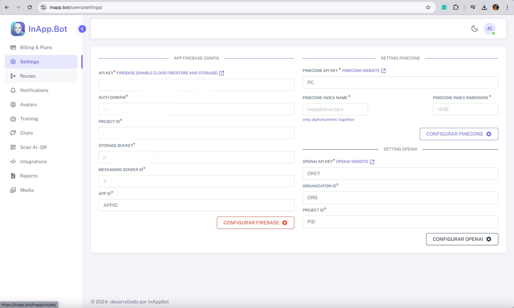
        <br>
        <em>free admin panel for InApp.Bot assistants</em>
      </td>
    </tr>
  </table>

> 🛠️ **We have created a cost-free admin panel for InApp.Bot assistants, with the option to upgrade to a premium subscription to avoid deploying the admin panel yourself.**

</div>

<details>
<summary><strong>🔍 Discover Everything the Admin Panel Offers</strong></summary>

- ⚙️ **Settings:** In this section, you can configure all the APIs necessary for the assistants to work properly. At InApp.Bot, we do not store the OpenAI or Pinecone API keys. Instead, these keys are securely stored in the Firebase project that you configure. This ensures that your sensitive information remains under your control and is protected within your own infrastructure. 

<table>
    <tr>
      <td align="center">
        
      </td>
    </tr>
  </table>

  - 🗺️ **Routes:** In this section, you can add custom routes within your app, allowing the assistant to seamlessly navigate and send specific routes to users. This feature enhances the user experience by guiding them through the app based on their interactions with the assistant.

<table>
    <tr>
      <td align="center">
        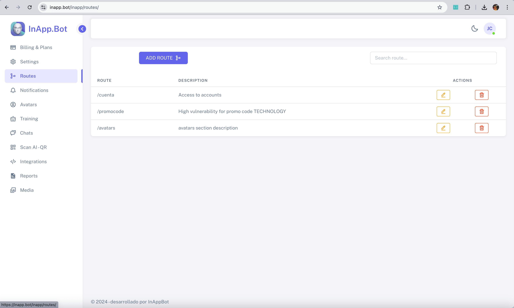
      </td>
    </tr>
  </table>

- 🔔 **Notifications:** In this section, you can send notifications to users through the InApp.Bot assistants. These assistants will have full context about the notification, enabling them to provide detailed and relevant information to users regarding the topic.

<table>
    <tr>
      <td align="center">
        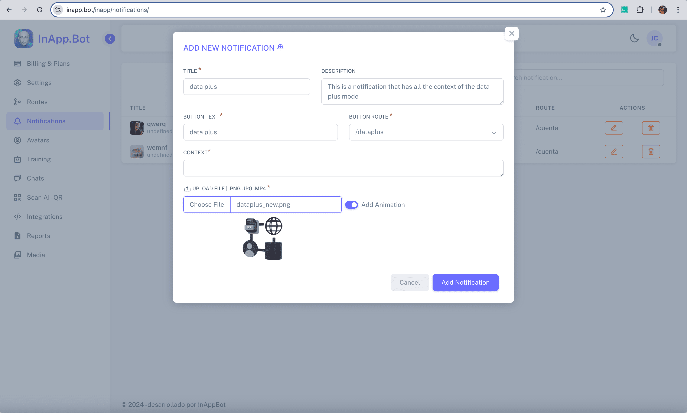
      </td>
    </tr>
  </table>

- 👤  **Avatars:** In this section, you can select from the available avatars to serve as the assistants in your app. You also have the option to upload your own custom avatars, giving you full control over the appearance and personality of your assistants.

<table>
    <tr>
      <td align="center">
        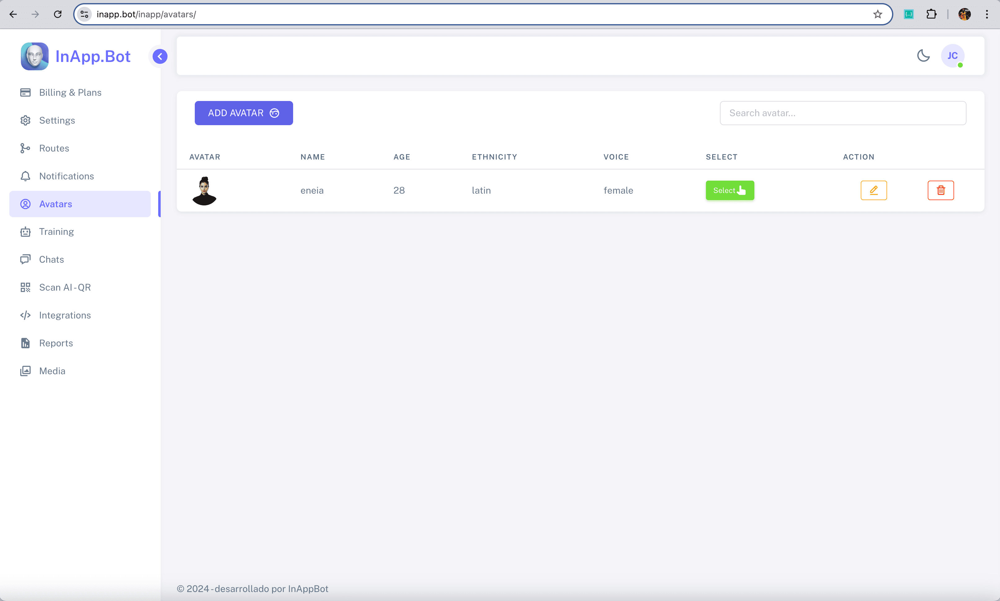
      </td>
    </tr>
  </table>

- 🧠  **Training:** In this section, you can train the assistants with the necessary knowledge to effectively support your app users. Additionally, you can configure the Large Language Models (LLMs) that power the assistants, ensuring they provide accurate and relevant responses.

<table>
    <tr>
      <td align="center">
        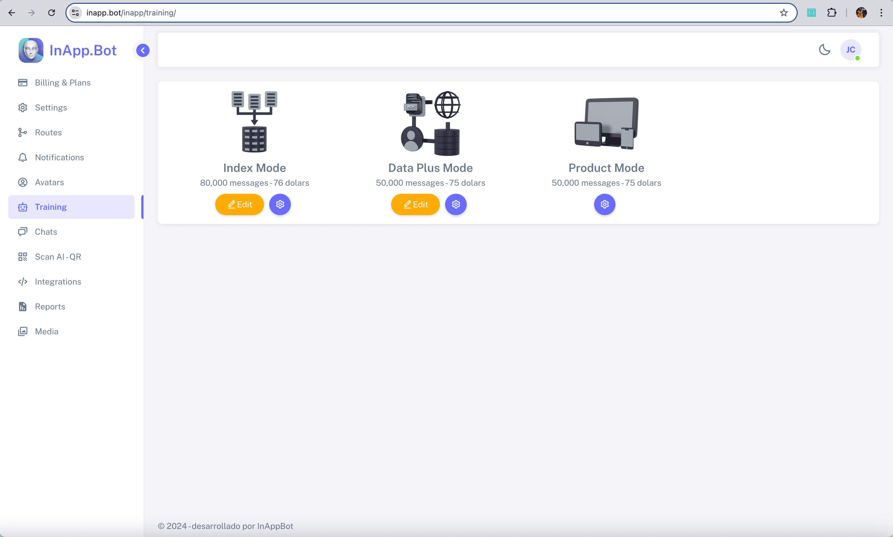
      </td>
    </tr>
  </table>

- 💬  **Chats:** In this section, you can view conversations between the assistant and your app users. You’ll have the ability to delete chats, add them to your FAQ section, and gain insights into what your users are asking. This feature allows you to better understand and address user needs.

<table>
    <tr>
      <td align="center">
        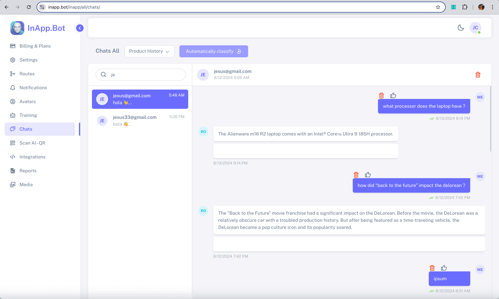
      </td>
    </tr>
  </table>

- 🔍  **Scan Ai:** In this section, you can train the Scan AI mode. When the assistants scan a QR code that you've added, they acquire knowledge about the associated product, allowing them to assist users with detailed information regarding that product.

<table>
    <tr>
      <td align="center">
        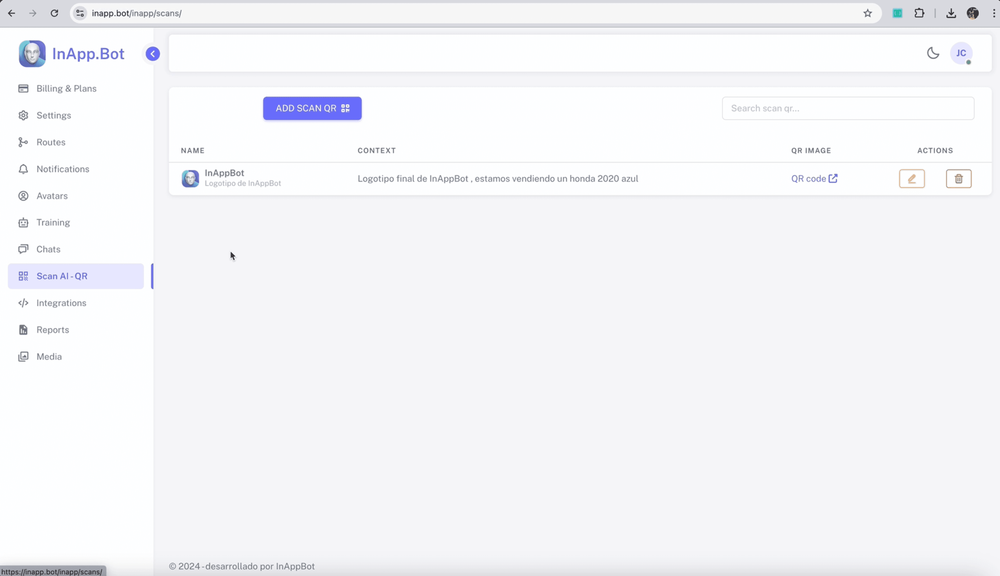
      </td>
    </tr>
  </table>

- 🔗  **Integrations:** In this section, you can find information on how to integrate InApp.Bot assistants into your existing apps. This area is still under development, but it will provide comprehensive guidance to ensure seamless integration.

<table>
    <tr>
      <td align="center">
        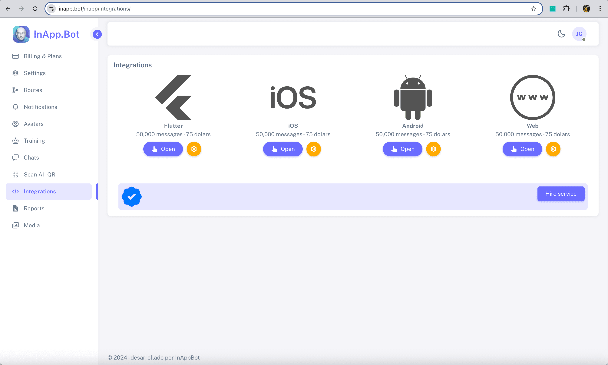
      </td>
    </tr>
  </table>  

 - 🖼️  **Media:** In this section, you can upload images and videos for the assistants to display to users. This feature allows you to enhance the user experience by providing rich multimedia content through the assistants.

<table>
    <tr>
      <td align="center">
        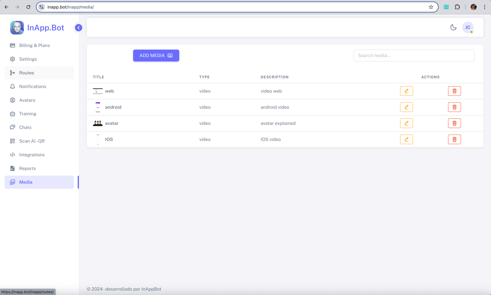
      </td>
    </tr>
  </table>   

</details>

<h4 align="center"> Technologies Used in the Admin Panel</h4>
<p align="center">  </p>

<a id="assistant-modes-discover-the-power-of-each-mode"></a>

## 🧠 Assistant Modes: Discover the power of each mode

InAppBot provides multiple modes that are tailored for different use cases, ensuring that you can offer the best user experience across various platforms and needs. Below are the available modes and their key features:

<a id="1-data-plus-mode"></a>        

#### 1. **Data Plus Mode**


<details>
  <summary>Click to expand</summary>

#### Description
- **Type:** RAG (Retrieval-Augmented Generation)

This mode is designed to enhance user interaction by incorporating additional knowledge through **PDF formats and web content**. When a user asks a question, the assistant first consults a **vector database** to retrieve relevant and specific context to inform the response. Based on this context, a deep learning language model (**LLM**) generates a personalized and detailed response.

What makes this process even more efficient is that the context retrieved from the vector database is refreshed with each query, eliminating the need to send all accumulated context to the LLM in every interaction. Instead, an advanced method is applied that allows the conversation to maintain coherence and continuity, even if the vector context from the previous question is not explicitly included in the next query to the LLM. This approach optimizes resource usage and ensures that responses remain relevant and consistent with the conversation’s flow without overloading the system with unnecessary information.

This strategy ensures that each response is not only informed by up-to-date and specific data but also maintains fluency and relevance throughout the entire user interaction, significantly enhancing the effectiveness of the assistant’s responses.

- **Response Speed:** Approximately **3 seconds** per response.
- **Costs:** The average cost is **$15** for every **50,000 messages** (including both questions and responses), based on using **2,000 tokens** per message.

#### Technologies
- **LLM:** Gemini 3.5 Flash, A state-of-the-art deep learning language model developed by Google, designed to deliver precise and contextually relevant responses.
- **Pinecone:** Vector database for efficient and rapid data storage and retrieval.
- **Firebase:** Secure and scalable mobile and web application development platform by Google.
- **Embedding Models:** Deep learning models that represent words, phrases, and documents as vectors, foundational for NLP tasks.
- **Knowledge Base:** Customizable integration of **PDF and web content**, enabling the assistant to respond with domain-specific information.

#### Use Cases
- **Technical Support in Software Applications:**
  - Upload user manuals, installation guides, and troubleshooting documents in **PDF** format.
  - The assistant provides detailed, contextual responses based on these documents.
- **Customer Support in E-commerce:**
  - Train the assistant with return policies, product guides, and FAQs.
  - Users receive accurate information about returns, product details, and more.
- **Specific Example:**
  - Train the assistant with a document like **your-company-document.pdf**.
  - Users can ask questions about its content to evaluate the assistant's understanding and accuracy.

</details>

<a id="2-index-mode"></a>

#### 2. **Index Mode**


<details>
  <summary>Click to expand</summary>

#### Description
- **Type:** RAG (Retrieval-Augmented Generation)

The **Index Mode** is specifically designed to optimize the retrieval and delivery of information within applications that require quick access to structured data. This mode functions by organizing and indexing content, allowing the virtual assistant to efficiently scan and retrieve the most relevant sections based on user queries.

**How Does It Work?**

- **Content Indexing:**
  - All relevant data and documents are indexed within the system, categorized into easily accessible segments, much like chapters in a book.
- **Efficient Retrieval:**
  - When a user asks a question, the assistant uses the indexed structure to scan for relevant segments, ensuring accurate and contextually appropriate responses.

- **Response Speed:** Approximately **3 seconds** per response.
- **Costs:** The average cost is **$15** for every **50,000 messages**, based on using **2,000 tokens** per message.

#### Technologies
- **LLM:** Gemini 3.5 Flash, Delivers precise and contextually relevant responses to user queries.
- **Firebase:** Backend for secure and efficient data management.
- **Knowledge Base:** Organized like a manual or a collection of books, where information is carefully curated, indexed, and structured for easy access.

#### Use Cases
- **Business Knowledge Management:**
  - Ideal for applications requiring quick and accurate responses based on indexed business data.
  - The assistant functions as a digital "book" of knowledge, manually fed with texts organized for precise retrieval.
- **Example of Use:**
  - Integrate business knowledge into the assistant with indices like **Contacts**.
  - If a user asks, "What is the company's email address?" the assistant consults the **Contacts** index to provide an accurate response.

</details>

<a id="3-scan-ai-mode"></a>

#### 3. **Scan AI Mode**


<details>
  <summary>Click to expand</summary>

#### Description
- **Type:** KPCS (Knowledge-Persistent Contextual Scanning)

The **Scan AI Mode** revolutionizes how users access information by allowing them to obtain immediate and relevant answers by simply scanning a **QR code**. Instead of searching through documents, users get instant access to information.

**How Does It Work?**

- **QR Code Generation:**
  - Generate specific QR codes for datasets or documents from the admin panel.
- **Scanning the QR Code:**
  - Users scan the QR code, and the assistant extracts all relevant information associated with it.
- **Instant Access to Knowledge:**
  - The assistant is ready to respond to user questions quickly and efficiently, providing accurate and contextualized answers in real-time.

- **Response Speed:** Approximately **2 seconds** per response.
- **Costs:** The average cost is **$15** for every **50,000 messages**, based on using **2,000 tokens** per message.

#### Technologies
- **LLM:** Gemini 3.5 Flash, Provides precise and contextually relevant responses.
- **Firebase:** Stores knowledge for quick retrieval via QR code.
- **Knowledge Base:** Tailored information accessible through QR scanning, ideal for product or topic-specific inquiries.

#### Use Cases
- **Car Rentals:**
  - Place a QR code inside rental cars.
  - Users scan the code to receive detailed vehicle information, user manuals, and maintenance info.
- **Product Manuals:**
  - Offer instant access to product details via QR codes on products.
  - The assistant provides specific information without the need to read manuals.

</details>

<a id="4-product-mode"></a>

#### 4. **Product Mode**


<details>
  <summary>Click to expand</summary>

#### Description
- **Type:** DDDS (Data-Driven Dialogue System)

This mode is designed for applications that need to provide detailed product information. App owners can upload product details directly into the product page, and the virtual assistant uses this data to respond to user inquiries efficiently and accurately.

By having direct access to specific product specifications, features, and FAQs, the assistant can deliver immediate, precise, and contextually relevant answers that align perfectly with the user's queries, enhancing the shopping experience.

- **Response Speed:** Approximately **2 seconds** per response.
- **Costs:** The average cost is **$15** for every **50,000 messages**, based on using **2,000 tokens** per message.

#### Technologies
- **LLM:** Gemini 3.5 Flash, Generates accurate and tailored responses to user queries.
- **Knowledge Base:** Product details are uploaded and maintained by the app owner, including specifications, features, and FAQs.

#### Use Cases
- **E-commerce:**
  - Answer detailed product queries in real-time on product pages.
  - Users can ask about product capacity, features, operating modes, etc.
- **Customer Support:**
  - Provide consistent, accurate product information.
  - Enhance consumer trust and potentially increase conversion rates.

</details>

<a id="other-features-of-inappbot-assistants"></a>

## 🌟 Other Features of InApp.Bot Assistants

InApp.Bot assistants come with a variety of powerful capabilities, including:

- **Frequent Messages:** Provide predefined responses for common user queries, ensuring quick and efficient communication.
- **Deliver WhatsApp Links:** Seamlessly send WhatsApp links to users, improving user engagement directly from your app.
- **Deliver Instagram Links:** Share Instagram links with users, integrating social media experiences directly within your assistant.
- **Deliver In-App Links:** Send users to specific parts of your app, enhancing navigation and user interaction.
- **Deliver Promotional Codes:** Easily share promotional codes with users, boosting engagement and rewards for your audience.
- **Deliver Videos:** Share videos with users to provide visual content and enhance the communication experience.
- **Deliver Images:** Send images to users, adding a visual component to your assistant's responses.

<p align="center">
  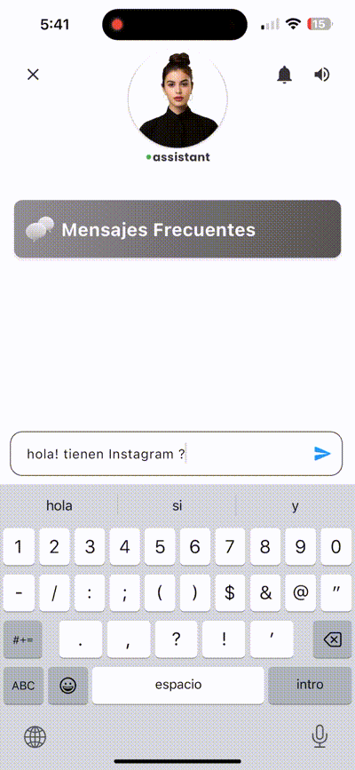
  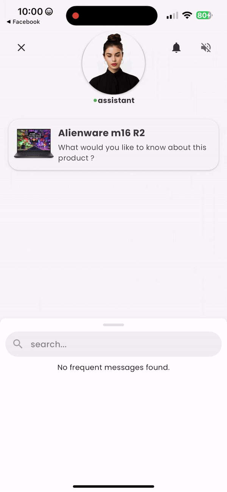
  
</p>

<a id="where-inappbot-assistants-can-be-embedded"></a>

## 🌐 Where inapp.bot Assistants Can Be Embedded

InApp.Bot assistants are built in Flutter and can be embedded into various technologies, offering flexibility across multiple platforms:

- 💻 **Flutter Apps:**  
  InApp.Bot is natively built with Flutter, allowing assistants to be embedded into cross-platform apps for Android, iOS, and the web.  
  **Testing Progress:** 🟩🟩🟩🟩🟩🟩🟨 90%

- 🍏 **iOS Apps:**  
  InApp.Bot assistants can be embedded in iOS apps.  
  **Testing Progress:** 🟩🟩🟩🟨⬜⬜⬜ 40%

- 🤖 **Android Apps:**  
  InApp.Bot assistants can be embedded in Android applications.  
  **Testing Progress:** 🟩🟩🟩🟨⬜⬜⬜ 40%

- 🌐 **Web Apps:**  
  InApp.Bot assistants can be embedded in web applications.  
  **Testing Progress:** 🟩🟩🟩🟨⬜⬜⬜ 40%


Whether you're building mobile apps, web apps, or cross-platform solutions, InApp.Bot can provide intelligent assistant capabilities across all major platforms.


<details>
<summary><strong>🔍 View Platform Examples</strong></summary>

<p align="center">
  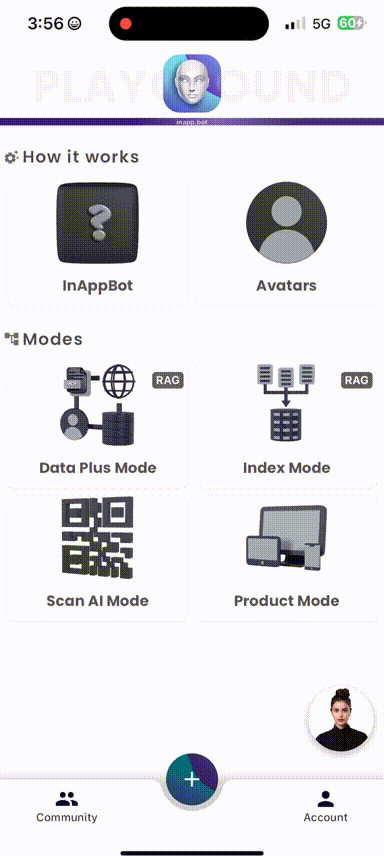
  
  
</p>
<p align="center">
  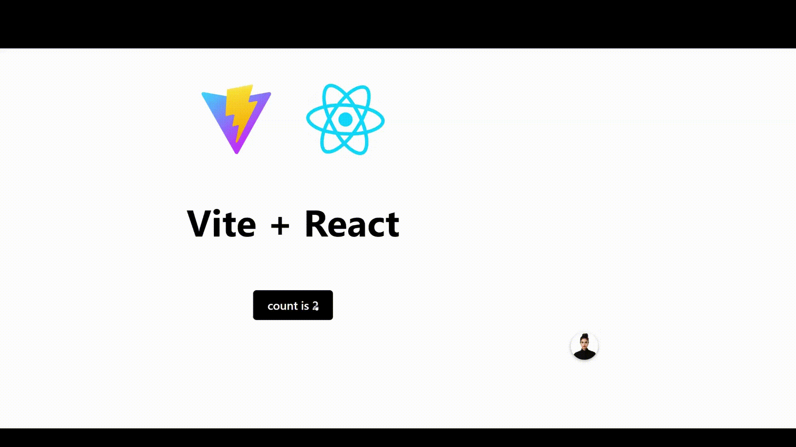
</p>

</details>

<a id="how-to-install-on-flutter-apps"></a>

## 📁 How to Install on Flutter Apps

<div align="center">
  <table>
    <tr>
      <td align="center">
        
        <br>
        <em>Seamless integration of InApp.Bot into your Flutter app</em>
      </td>
    </tr>
  </table>

> ⚙️ **Easily integrate InApp.Bot into your Flutter project by following these steps:**

</div

To integrate the InApp.Bot assistant into your Flutter project, follow these simple steps:

1. **Add the in_app_bot Folder to the lib Directory**: 
   Copy the in_app_bot folder into the lib directory of your existing Flutter project.

2. **Update Dependencies**: 
   Open your pubspec.yaml file and add the following dependencies to include the required packages for InApp.Bot:

   ```yaml
   dependencies:
     cached_network_image: ^3.2.3
     cloud_firestore: ^5.2.1
     equatable: ^2.0.5
     file_picker: ^6.1.1
     firebase_auth: ^5.1.4
     firebase_core: ^3.3.0
     firebase_storage: ^12.1.3
     flutter:
       sdk: flutter
     flutter_localization: ^0.1.14
     flutter_riverpod: ^2.4.0
     flutter_secure_storage: ^9.2.2
     flutter_spinkit: ^5.2.0
     flutter_tts: ^4.0.2
     font_awesome_flutter: ^10.7.0
     google_generative_ai: ^0.4.3
     google_sign_in: ^6.1.5
     http: ^1.1.0
     intl: ^0.19.0
     langchain_openai: ^0.3.0
     lottie: ^2.6.0
     path: ^1.8.3
     path_provider: ^2.1.1
     pinecone: ^0.7.2
     qr_code_scanner: ^1.0.1
     share_plus: ^7.2.2
     shared_preferences: ^2.2.3
     sqflite: ^2.3.0
     url_launcher: ^6.2.0
     uuid: ^4.2.1
     video_player: ^2.8.2
     flutter_dotenv: ^5.1.0
   ```

3. **Create Firebase Function**:
   Create a function in Firebase using the code located in the `functions` folder. These will be the endpoints used for the application.

4. **Set Up Environment Variables**:
   Create a `.env` file in the root of your project with the following environment variables:

   ```
   API_ENDPOINT=<YOUR_OPENAI_AND_PINECONE_API_KEY_ENDPOINT>
   GEMINI_API_KEY=<YOUR_GEMINI_API_KEY_ENDPOINT>
   PINECONE_INDEX_NAME=<YOUR_PINECONE_INDEX_NAME>
   PINECONE_PROJECT_ID=<YOUR_PINECONE_PROJECT_ID>
   PINECONE_TOP_K=<TOP_K_VALUE>
   PINECONE_BASE_URL=<YOUR_PINECONE_BASE_URL>
   ```

5. **Call the Assistant in Your App**: 
   To use the assistant with the desired mode, you can reference the example in `in_app_bot/lib/playground/presentation/widgets/play_row_widget.dart`.

   **Highlighted Code: Set the Assistant Mode**
   ```dart
   final currentModeProvider = StateProvider<ChatMode>((ref) => ChatMode.dataplusMode);
   ```

   You can then use this provider in your app to configure and call the assistant with the correct mode.

<a id="how-to-embed-in-ios-android-and-web-apps"></a>

## How to Embed in iOS, Android, and Web Apps

To embed InApp.Bot into your iOS, Android, or Web applications, follow the official Flutter "Add to App" guide at [Flutter Add-to-App Documentation](https://docs.flutter.dev/add-to-app).

<a id="installation-service-for-ai-assistants-in-your-projects"></a>

## 🛠️✨ Installation Service for inapp.bot Assistants in Your Projects

At **InApp.Bot**, we not only provide a powerful virtual assistant solution but also offer **personalized installation services** for integrating our AI assistants seamlessly into your existing applications. Whether your project is built on **Flutter, iOS, Android**, or **web platforms**, our team of experienced developers will handle the entire setup process, ensuring that your virtual assistants are embedded smoothly and efficiently.

Here’s why you should consider our installation services:

- **Hassle-Free Integration**: Let us take care of the complex configuration and technical details so that you can focus on what truly matters—growing your business.
  
- **Tailored to Your Needs**: Every application is unique, and we adapt our integration process to meet the specific needs of your project. Whether you need custom features, special configurations, or enhanced AI capabilities, we’ll make sure the assistant works perfectly within your environment.

- **Boost Productivity**: By installing our assistants, you’ll enhance user interactions, automate responses, and provide real-time support—all of which will help boost productivity and user satisfaction.

- **Future-Proof Your App**: With regular updates and advanced AI features, our assistants evolve alongside your application, ensuring long-term scalability and effectiveness.

Our installation services provide you with the expertise and peace of mind you need to bring intelligent automation to your apps. Take the next step in revolutionizing your user experience by reaching out to our team for a **quick and seamless installation**!

We’re confident that once you experience the convenience and power of our AI assistants, you won’t look back.

Get in touch today and let us help you **unlock the full potential** of your applications with **InApp.Bot**!

For installation inquiries, feel free to contact us at:  
📧 **jesuscastillo@inapp.bot**

<a id="installation-for-developers"></a>

## Installation for Developers

```bash
# Clone the repository
$ git clone https://github.com/Inappbot/inapp.bot.git

# Install dependencies
$ flutter pub get

# Run the app
$ flutter run
```
<a id="become-a-contributor-and-shape-the-future-of-inappbot"></a>

## 🤝 Become a Contributor and Shape the Future of InApp.Bot

By contributing to InApp.Bot, you’ll be joining a growing global team working together to shape the future of AI-powered assistants. Your contributions today will directly impact the development of this cutting-edge technology, which will soon be used by applications worldwide. 

As a contributor, you'll have the opportunity to collaborate with other forward-thinking developers, grow your skills, and play a significant role in shaping the evolution of inapp.bot. Together, we are making InApp.Bot smarter, more adaptable, and more powerful.

### Exclusive Perk for Contributors
Every contributor will receive a **free premium account** for the admin panel of InApp.Bot, which is already up and running. With this premium account, you’ll have full control and customization over your AI assistants, giving you access to advanced features and tools to create the best user experience possible.

The duration of the premium account will depend on the level of contribution:
- **Significant contributions** (such as feature development, major bug fixes, or large documentation updates) can grant up to **one year** of premium access.
- **Smaller contributions** (such as minor bug fixes, improvements, or code reviews) will grant shorter periods of premium access.

This way, we ensure that every contribution is rewarded, while encouraging impactful involvement in the project.

### Meet Our Contributors

We are proud to have a community of dedicated contributors who are helping to shape the future of InApp.Bot. Join us and be a part of this exciting journey!

<a href="https://github.com/Inappbot/inapp.bot/graphs/contributors">
  
</a>

### How You Can Contribute

- **Submit Pull Requests**: Improve the code, add features, or fix bugs.
- **File Issues**: Help identify problems or suggest new ideas for the project.
- **Write Documentation**: Enhance our docs to make it easier for others to contribute and use the project.
- **Spread the Word**: Share the project with your network or write about it on social media.

Your contributions will have a lasting impact on the future of inapp.bot assistants. We can’t wait for you to join us!

<a id="why-were-building-inappbot"></a>
## 🌱 Why Were Building InApp.Bot


InApp.Bot began as a personal challenge to learn Flutter after a long break from programming. After 10 years without writing a line of code, I hired a freelancer to develop a car rental app for me. However, after more than a year of waiting with no progress, I decided to take matters into my own hands. I dived into learning Flutter, but soon realized that following tutorials wasn’t my style—I learn best by doing. 

That’s when I discovered the power of AI. Tools like ChatGPT, Claude, and Gemini became my mentors, explaining concepts and helping me write code. Within just one week, I had created an AI assistant for the project the freelancer had been working on. I was amazed at what I could achieve with the help of AI and poured all my free time into building this project.

As I continued, the AI assistants guided me, and I learned that a Flutter app could be embedded into native apps—something I hadn’t known before. Excited by this revelation, I shared my project in a Flutter community. I received 30 negative comments, but one stood out. It advised me to focus on scalability. After running the numbers, I realized my original project wasn’t scalable, so I abandoned it.

A few months later, I returned to the idea with a renewed focus: how to build a scalable AI assistant. This time, with the help of ChatGPT, Claude, and Gemini, I was able to **finish the MVP of InApp.Bot**. Now, I want to collaborate with the community to create the **most advanced, open-source AI assistant** in existence. 

When I started, few major tech companies were integrating AI into their apps. Today, giants like Amazon, WhatsApp, and GitHub are leading the charge with their own assistants. The following GIFs show AI assistants embedded in these apps:

<p align="center">
  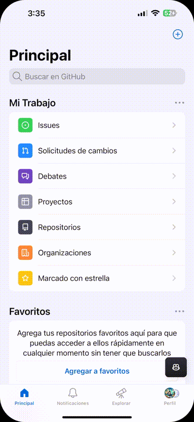
  
  
</p>

The time has come for all of us to have AI assistants in our projects. Together, we can build a future where these powerful tools are accessible to everyone. **InApp.Bot** isn’t just my project—it’s **our project**. Let’s create the most advanced assistant together, focusing on our personal projects while building **InApp.Bot assistants** to enhance your apps.

Let’s build something incredible—**open, scalable, and powered by the community**.

<a id="roadmap"></a>

## ~~Roadmap~~ Missions

- [x] Initial release
- [x] Integration with Gemini API
- [x] Creation of the admin panel
- [ ] Creation of documentation
- [ ] Integration with OpenAI API
- [ ] Support for voice commands
- [ ] Implementation of voices through APIs
- [ ] Theme creation
- [ ] Implementation of secret features

<a id="support"></a>

## Support

<a href="https://buymeacoffee.com/inappbot" target="_blank"></a>

<a id="license"></a>

## License

Distributed under the MIT license. See LICENSE for more information.

---

<p align="center">
  Developed with ❤️ by the inapp.bot team
  <br><br>
  <a href="https://github.com/Inappbot/inapp.bot-admin">
    
  </a>
</p>

<td align="center">
  <a href="#up">
    
  </a>
</td>