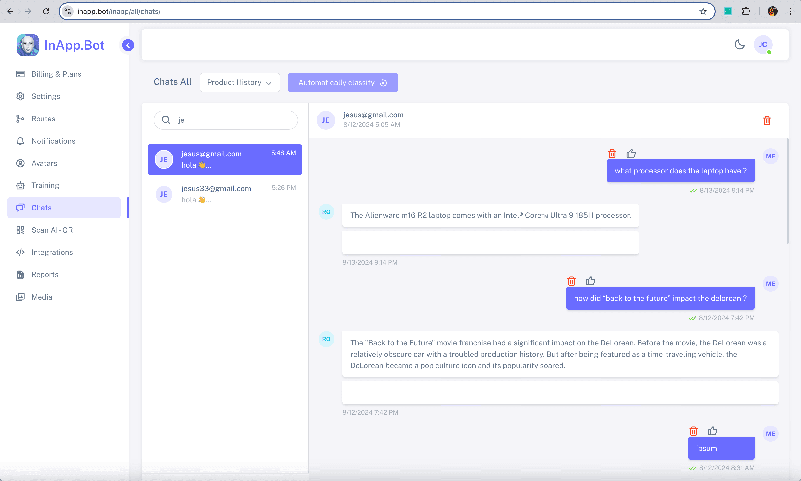

<div align="center">
<a id="up"></a>
  
[English](../../../README.md) • Español • [中文](README_ZH.md) • [日本語](README_JA.md) • [हिन्दी](README_HI.md)

</div>

<p align="center">
  <a href="https://inapp.bot">
    
  </a>
</p>

<h1 align="center">
  
</h1>

<h4 align="center">Asistentes virtuales que se integran en todas las plataformas, mejorando la productividad de tus aplicaciones.</h4>

<p align="center">
  
  <a href="https://github.com/Inappbot/inapp.bot/blob/main/LICENSE">
    
  </a>
  <a href="https://github.com/Inappbot/inapp.bot/stargazers">
    
  </a>
</p>

<p align="center">
    <a href="https://inapp.bot"><b>Sitio Web</b></a> •
    <a href="https://twitter.com/inappbot"><b>Twitter</b></a> •
    <a href="https://www.youtube.com/@inappbot"><b>Youtube</b></a>
</p>

<p align="center">
 <a href="https://www.youtube.com/watch?v=daEkkwFkm_Q">
  
    </a>
    
  > **Presentación de InApp.Bot en el hackathon de la API de Gemini.**
</p>
<p align="center" style="margin-top: 5px;">
  <a href="https://www.youtube.com/watch?v=daEkkwFkm_Q">
    
  </a>
</p>

## 📖 Tabla de Contenidos

- [🚀 Inicio Rápido](#-quick-start)
  - [Descargar el Playground](#download-the-playground)
  - [InApp.Bot v1.0.0](#inappbot-v100)
- [✨ Funcionalidades Clave](#key-features)
  - [Avatares: Dando Vida a Tu Asistente](#avatars-bringing-the-assistant-to-life)
  - [Texto a Voz: Dándole Voz a Tu Asistente](#text-to-speech-giving-voice-to-your-assistant)
  - [Panel de Administración](#admin-panel-manage-your-assistants)
- [🧠 Modos de Asistente](#assistant-modes-discover-the-power-of-each-mode)
  - [Modo Data Plus](#1-data-plus-mode)
  - [Modo Index](#2-index-mode)
  - [Modo AI Scan](#3-scan-ai-mode)
  - [Modo Producto](#4-product-mode)
- [🌟 Características Adicionales](#other-features-of-inappbot-assistants)
- [🌐 Plataformas Compatibles](#where-inappbot-assistants-can-be-embedded)
- [⚙️ Guías de Instalación](#how-to-install-on-flutter-apps)
  - [Apps Flutter](#how-to-install-on-flutter-apps)
  - [Apps iOS, Android y Web](#how-to-embed-in-ios-android-and-web-apps)
  - [Servicio de Instalación Profesional](#installation-service-for-ai-assistants-in-your-projects)
  - [Instalación para Desarrolladores](#installation-for-developers)
- [🤝 Contribuir al Proyecto](#become-a-contributor-and-shape-the-future-of-inappbot)
- [🌱 Por Qué Estamos Construyendo InApp.Bot](#why-were-building-inappbot)
- [Hoja de Ruta](#roadmap)
- [Soporte](#support)
- [Licencia](#license)

<a id="download-the-playground"></a>

## 🚀 Inicio Rápido

### Descargar el Playground

<table>
  <tr>
    <th style=" color: black; text-align: center;">iOS</th>
    <th style=" color: black; text-align: center;">Android</th>
  </tr>
  <tr>
    <td align="center">
      <a href="https://testflight.apple.com/join/32hEyxmc">
        
      </a>
    </td>
    <td align="center">
      <a href="https://play.google.com/store/apps/details?id=bot.inapp.inappbot">
        
      </a>
    </td>
  </tr>
  <tr>
    <td align="center">📌 <em>Acceso anticipado en TestFlight</em></td>
    <td align="center">📌 <em>Únete a nuestro programa beta</em></td>
  </tr>
</table>

<details>
<summary>📱 Guía rápida de instalación</summary>

### Configuración de iOS

1. Toca el botón "Descargar en la App Store" arriba.
2. Serás redirigido a TestFlight.
3. Si no está instalada, descarga TestFlight desde la App Store.
4. Acepta la invitación para probar nuestra app.
5. ¡Instala y comienza tu experiencia!

### Configuración de Android

1. Haz clic en el botón "Consíguelo en Google Play".
2. Serás dirigido a nuestra página en la Play Store.
3. Únete al programa beta (si está disponible).
4. ¡Instala y sumérgete en la experiencia!

</details>

<a id="inappbot-v100"></a>

## inapp.bot v1.0.0

InAppBot es un software de asistente virtual multiplataforma que revoluciona la forma en que interactúas con tus usuarios. Este poderoso asistente, diseñado para integrarse perfectamente en aplicaciones Flutter, iOS, Android y web, no solo responde a las consultas de los usuarios, sino que también ofrece recomendaciones personalizadas y los guía en tiempo real, mejorando su experiencia y aumentando la eficiencia de tu negocio. Como una solución de código abierto, InAppBot no solo te permite personalizar cada interacción, sino que también te ofrece la libertad de adaptar el asistente a las necesidades específicas de tu aplicación.

<div align="center">
  
  <br>
  <em>Asistente inapp.bot en una app Flutter</em>
</div>

> 👩‍💻 **¡Hemos creado un asistente para dar superpoderes a tus apps!**


<details>
<summary><strong>🔍 ¡Descubre lo que ofrece esta versión!</strong></summary>

### **🤖 LLM por Gemini - Expandiendo las Posibilidades**

- **🚀 IA Avanzada:** Aprovecha el poder de Gemini de Google para una comprensión y generación de lenguaje de última generación.
- 🔮 **Preparado para el Futuro:** Mantente a la vanguardia con futuras actualizaciones y capacidades de IA mejoradas.
- 🌐 **Soporte Multilingüe:** Comunícate de manera efectiva con usuarios de diferentes idiomas y culturas.

### **🚀 Base de Datos Vectorial por Pinecone**

- ⚡ **Recuperación Rápida:** Busca y recupera información de grandes volúmenes de datos de manera eficiente.
- 🔍 **Búsqueda Semántica:** Comprende la intención del usuario y proporciona respuestas más precisas y contextuales.
- 📈 **Escalabilidad:** Maneja fácilmente conjuntos de datos crecientes sin comprometer el rendimiento.

### **💾 Base de Datos Firebase**

- 🔐 **Segura y Escalable:** Firebase asegura que tus datos estén protegidos y sean escalables, permitiendo una gestión fácil de grandes conjuntos de datos sin comprometer la seguridad.
- ☁️ **Sincronización en Tiempo Real:** Sincroniza tus datos en todas las plataformas en tiempo real, brindando una experiencia fluida a los usuarios independientemente del dispositivo.
- 🛠️ **Amigable para Desarrolladores:** Con la configuración intuitiva de Firebase, integrar bases de datos en tu proyecto es rápido y sin complicaciones.

### **📚 Base de Conocimiento por PDF, Web y Texto**

- 📊 **Fuentes Diversas:** Integra información de varios formatos para crear una base de conocimiento completa.
- 🔄 **Actualizaciones Fáciles:** Añade o modifica rápidamente la información para mantener el conocimiento de tu asistente al día.
- 🎯 **Aprendizaje Enfocado:** Enfócate en dominios o temas específicos para convertir a tu asistente en un experto en su campo.

### **👤 Avatares por inapp.bot**

- 🌟 **Visuales Personalizables:** Da vida a tu asistente con avatares de video personalizables que reflejen tu marca y creen una experiencia de usuario más atractiva.
- 👁️ **Animaciones de Alta Calidad:** Utiliza avatares de video realistas para mejorar las interacciones y fomentar conexiones más fuertes con los usuarios.
- 🎭 **Identidad de Marca:** Personaliza los avatares para que coincidan con el estilo de tu proyecto, haciendo que tu aplicación sea verdaderamente única.

### **🗣️ Texto a Voz (TTS)**

- 💰 **Completamente Gratis:** Al utilizar el motor TTS nativo del dispositivo, no hay costos adicionales para la síntesis de voz.
- 🎧 **Integración con el Dispositivo:** Usa las funciones TTS integradas para un rendimiento óptimo sin necesidad de servicios externos.
- 🌐 **Soporte Multilingüe:** Aprovecha la configuración de idioma del dispositivo para comunicarte en el idioma preferido del usuario.

### **🛠️ Panel de Administración por inapp.bot**

- 🎛️ **Control Total:** Administra cada aspecto de tu proyecto a través de un panel de administración optimizado, desde la gestión de datos hasta las interacciones con los usuarios.
- 🚀 **Interfaz Amigable:** Diseñada para ser fácil de usar, permitiendo que realices actualizaciones y cambios rápidamente.
- 🖥️ **Control de Configuración:** Personaliza configuraciones y preferencias desde una ubicación central.

</details>

<h4 align="center"> Tecnologías Utilizadas en los Asistentes</h4>
<p align="center">  </p>

<a id="key-features"></a>

## ⭐ Características Clave

<a id="avatars-bringing-the-assistant-to-life"></a>

### 👩‍💻 Avatares: ¡Dando Vida al Asistente!

<div align="center">
  <table>
    <tr>
      <td align="center" style="width: 53.8%;">
        
        <br>
        <em>Video base</em>
      </td>
      <td align="center" style="width: 46.2%;">
        
        <br>
        <em>Resultado</em>
      </td>
    </tr>
  </table>

> 🎥 **¡Integramos impresionantes avatares gratuitos a partir de videos!**
</div>

<details>
<summary><strong>🔍 ¡Descubre por qué elegimos videos para nuestros avatares!</strong></summary>

### **El Poder de los Avatares en Video**

Al desarrollar InAppBot, tomamos la decisión estratégica de incorporar avatares en video como una característica central. Aquí está el porqué:

- 💰 **Económico:** Las soluciones existentes de avatares interactivos suelen tener un precio elevado.
- 🤖 **Toque Humano:** Aunque las opciones 3D son innovadoras, a menudo carecen del realismo y la conexión que ofrecen los videos.
- 🌟 **Autenticidad:** La tecnología de video ofrece una experiencia más genuina y atractiva para los usuarios.

### **🚀 Beneficios**

- 🎨 **Personalización:** Sube y selecciona tus propios avatares en video para reflejar la identidad de tu marca.
- 🤝 **Conexiones más Profundas:** Fomenta interacciones más significativas con tu audiencia.
- 🧠 **Experiencias Memorables:** Haz que las interacciones con tu asistente destaquen y dejen una impresión duradera.

### **💯 Completamente Gratis**

- 🆓 **Sin Costos Ocultos:** Sube tus videos y crea avatares personalizados sin costo alguno.
- 🧪 **Experimenta Libremente:** Prueba diferentes avatares sin restricciones de presupuesto.
- 💼 **Perfecto para Cualquier Proyecto:** Ya seas una startup o una empresa establecida, aprovecha las capacidades de InAppBot.

</details>

<br>
<br>

<a id="text-to-speech-giving-voice-to-your-assistant"></a>

### 🗣️ Texto a Voz: Dando Voz a Tu Asistente

<div align="center">
  
  <br>
  <em>Integración perfecta de TTS con avatares</em>
</div>

> 🗣️ **Utilizamos el TTS de los dispositivos, sin costo adicional**

<details>
<summary><strong>🔍 ¡Descubre cómo aprovechamos el TTS nativo de los dispositivos para dar vida a tu asistente, completamente gratis!</strong></summary>

Al desarrollar InAppBot, aprovechamos las capacidades integradas de Texto a Voz (TTS) de los dispositivos para proporcionar una experiencia de voz sin costo adicional. Aquí te explicamos por qué:

- 💰 **Completamente Gratis:** Al utilizar el motor TTS nativo del dispositivo, no hay costos adicionales para la síntesis de voz.
- 🎧 **Integración con el Dispositivo:** Usa las funciones TTS integradas para un rendimiento óptimo sin necesidad de servicios externos.
- 🌐 **Soporte Multilingüe:** Aprovecha la configuración de idioma del dispositivo para comunicarte en el idioma preferido del usuario.
- 🔋 **Rendimiento Eficiente:** El TTS nativo está optimizado para el dispositivo, lo que asegura una mejor duración de la batería y gestión de recursos.
- 📱 **Compatibilidad Multiplataforma:** Funciona perfectamente en todos los dispositivos y plataformas que soporten TTS.

</details>

<br>
<br>

<a id="admin-panel-manage-your-assistants"></a>

### 🛠️ Panel de Administración: Gestiona tus Asistentes

<div align="center">
  <table>
    <tr>
      <td align="center">
        
        <br>
        <em>Panel de administración gratuito para los asistentes de InApp.Bot</em>
      </td>
    </tr>
  </table>

> 🛠️ **Hemos creado un panel de administración gratuito para los asistentes de InApp.Bot, con la opción de actualizar a una suscripción premium para evitar desplegar el panel tú mismo.**

</div>

<details>
<summary><strong>🔍 ¡Descubre todo lo que ofrece el Panel de Administración!</strong></summary>

- ⚙️ **Configuración:** En esta sección, puedes configurar todas las APIs necesarias para que los asistentes funcionen correctamente. En InApp.Bot no almacenamos las claves de API de OpenAI o Pinecone. En su lugar, estas claves se almacenan de manera segura en el proyecto Firebase que configures. Esto asegura que tu información sensible permanezca bajo tu control y esté protegida dentro de tu propia infraestructura.

<table>
    <tr>
      <td align="center">
        
      </td>
    </tr>
  </table>

  - 🗺️ **Rutas:** En esta sección, puedes agregar rutas personalizadas dentro de tu app, permitiendo que el asistente navegue sin problemas y envíe rutas específicas a los usuarios. Esta función mejora la experiencia del usuario al guiarlos por la app según sus interacciones con el asistente.

<table>
    <tr>
      <td align="center">
        
      </td>
    </tr>
  </table>

- 🔔 **Notificaciones:** En esta sección, puedes enviar notificaciones a los usuarios a través de los asistentes de InApp.Bot. Estos asistentes tendrán todo el contexto sobre la notificación, permitiéndoles proporcionar información detallada y relevante a los usuarios sobre el tema.

<table>
    <tr>
      <td align="center">
        
      </td>
    </tr>
  </table>

- 👤  **Avatares:** En esta sección, puedes seleccionar entre los avatares disponibles para que sirvan como los asistentes en tu app. También tienes la opción de subir tus propios avatares personalizados, dándote el control total sobre la apariencia y personalidad de tus asistentes.

<table>
    <tr>
      <td align="center">
        
      </td>
    </tr>
  </table>

- 🧠  **Entrenamiento:** En esta sección, puedes entrenar a los asistentes con el conocimiento necesario para apoyar eficazmente a los usuarios de tu app. Además, puedes configurar los Modelos de Lenguaje (LLMs) que potencian a los asistentes, asegurando que proporcionen respuestas precisas y relevantes.

<table>
    <tr>
      <td align="center">
        
      </td>
    </tr>
  </table>

- 💬  **Chats:** En esta sección, puedes ver las conversaciones entre el asistente y los usuarios de tu app. Tendrás la capacidad de eliminar chats, agregarlos a tu sección de preguntas frecuentes (FAQ) y obtener información sobre lo que los usuarios están preguntando. Esta función te permite comprender mejor y atender las necesidades de los usuarios.

<table>
    <tr>
      <td align="center">
        
      </td>
    </tr>
  </table>

- 🔍  **Scan Ai:** En esta sección, puedes entrenar el modo Scan AI. Cuando los asistentes escanean un código QR que hayas agregado, adquieren conocimiento sobre el producto asociado, permitiéndoles ayudar a los usuarios con información detallada sobre dicho producto.

<table>
    <tr>
      <td align="center">
        
      </td>
    </tr>
  </table>

- 🔗  **Integraciones:** En esta sección, puedes encontrar información sobre cómo integrar los asistentes de InApp.Bot en tus aplicaciones existentes. Esta área aún está en desarrollo, pero proporcionará una guía completa para garantizar una integración sin problemas.

<table>
    <tr>
      <td align="center">
        
      </td>
    </tr>
  </table>  

 - 🖼️  **Multimedia:** En esta sección, puedes subir imágenes y videos para que los asistentes los muestren a los usuarios. Esta función te permite mejorar la experiencia del usuario proporcionando contenido multimedia enriquecido a través de los asistentes.

<table>
    <tr>
      <td align="center">
        
      </td>
    </tr>
  </table>   

</details>

<h4 align="center"> Tecnologías Utilizadas en el Panel de Administración</h4>
<p align="center">  </p>

<a id="assistant-modes-discover-the-power-of-each-mode"></a>

## 🧠 Modos de Asistente: Descubre el poder de cada modo

InAppBot ofrece múltiples modos que están diseñados para diferentes casos de uso, asegurando que puedas brindar la mejor experiencia de usuario en varias plataformas y necesidades. A continuación se muestran los modos disponibles y sus características clave:

<a id="1-data-plus-mode"></a>

#### 1. **Modo Data Plus**


<details>
  <summary>Haz clic para expandir</summary>

#### Descripción
- **Tipo:** RAG (Generación Aumentada por Recuperación)

Este modo está diseñado para mejorar la interacción del usuario incorporando conocimientos adicionales a través de **formatos PDF y contenido web**. Cuando un usuario hace una pregunta, el asistente primero consulta una **base de datos vectorial** para recuperar contexto relevante y específico que informará la respuesta. Basado en este contexto, un modelo de lenguaje profundo (**LLM**) genera una respuesta personalizada y detallada.

Lo que hace que este proceso sea aún más eficiente es que el contexto recuperado de la base de datos vectorial se actualiza con cada consulta, eliminando la necesidad de enviar todo el contexto acumulado al LLM en cada interacción. En su lugar, se aplica un método avanzado que permite que la conversación mantenga coherencia y continuidad, incluso si el contexto vectorial de la pregunta anterior no se incluye explícitamente en la siguiente consulta al LLM. Este enfoque optimiza el uso de recursos y garantiza que las respuestas sigan siendo relevantes y consistentes con el flujo de la conversación sin sobrecargar el sistema con información innecesaria.

Esta estrategia garantiza que cada respuesta no solo esté informada por datos actualizados y específicos, sino que también mantenga fluidez y relevancia a lo largo de toda la interacción del usuario, mejorando significativamente la efectividad de las respuestas del asistente.

- **Velocidad de respuesta:** Aproximadamente **3 segundos** por respuesta.
- **Costos:** El costo promedio es de **$15** por cada **50,000 mensajes** (incluyendo preguntas y respuestas), basado en el uso de **2,000 tokens** por mensaje.

#### Tecnologías
- **LLM:** Gemini 3.5 Flash, un modelo de lenguaje profundo de última generación desarrollado por Google, diseñado para ofrecer respuestas precisas y contextualmente relevantes.
- **Pinecone:** Base de datos vectorial para almacenamiento y recuperación de datos eficiente y rápida.
- **Firebase:** Plataforma de desarrollo de aplicaciones móviles y web segura y escalable de Google.
- **Modelos de Embeddings:** Modelos de aprendizaje profundo que representan palabras, frases y documentos como vectores, fundamentales para las tareas de procesamiento del lenguaje natural.
- **Base de Conocimiento:** Integración personalizable de **contenido en PDF y web**, que permite al asistente responder con información específica del dominio.

#### Casos de Uso
- **Soporte Técnico en Aplicaciones de Software:**
  - Carga manuales de usuario, guías de instalación y documentos de solución de problemas en formato **PDF**.
  - El asistente proporciona respuestas detalladas y contextuales basadas en estos documentos.
- **Atención al Cliente en Comercio Electrónico:**
  - Entrena al asistente con políticas de devoluciones, guías de productos y preguntas frecuentes.
  - Los usuarios reciben información precisa sobre devoluciones, detalles de productos y más.
- **Ejemplo Específico:**
  - Entrena al asistente con un documento como **your-company-document.pdf**.
  - Los usuarios pueden hacer preguntas sobre su contenido para evaluar la comprensión y precisión del asistente.

</details>

<a id="2-index-mode"></a>

#### 2. **Modo Index**


<details>
  <summary>Haz clic para expandir</summary>

#### Descripción
- **Tipo:** RAG (Generación Aumentada por Recuperación)

El **Modo Index** está específicamente diseñado para optimizar la recuperación y entrega de información dentro de aplicaciones que requieren acceso rápido a datos estructurados. Este modo funciona organizando e indexando el contenido, permitiendo que el asistente virtual escanee y recupere eficientemente las secciones más relevantes basadas en las consultas del usuario.

**¿Cómo Funciona?**

- **Indexación de Contenido:**
  - Todos los datos y documentos relevantes se indexan dentro del sistema, categorizados en segmentos de fácil acceso, como los capítulos de un libro.
- **Recuperación Eficiente:**
  - Cuando un usuario hace una pregunta, el asistente utiliza la estructura indexada para escanear segmentos relevantes, garantizando respuestas precisas y apropiadas en el contexto.

- **Velocidad de Respuesta:** Aproximadamente **3 segundos** por respuesta.
- **Costos:** El costo promedio es de **$15** por cada **50,000 mensajes**, basado en el uso de **2,000 tokens** por mensaje.

#### Tecnologías
- **LLM:** Gemini 3.5 Flash, proporciona respuestas precisas y contextualmente relevantes a las consultas de los usuarios.
- **Firebase:** Plataforma de backend para la gestión segura y eficiente de datos.
- **Base de Conocimiento:** Organizada como un manual o una colección de libros, donde la información está cuidadosamente curada, indexada y estructurada para fácil acceso.

#### Casos de Uso
- **Gestión del Conocimiento Empresarial:**
  - Ideal para aplicaciones que requieren respuestas rápidas y precisas basadas en datos empresariales indexados.
  - El asistente funciona como un "libro" digital de conocimiento, alimentado manualmente con textos organizados para una recuperación precisa.
- **Ejemplo de Uso:**
  - Integra conocimientos empresariales en el asistente con índices como **Contactos**.
  - Si un usuario pregunta: "¿Cuál es el correo electrónico de la empresa?", el asistente consulta el índice **Contactos** para proporcionar una respuesta precisa.

</details>

<a id="3-scan-ai-mode"></a>

#### 3. **Modo Scan AI**


<details>
  <summary>Haz clic para expandir</summary>

#### Descripción
- **Tipo:** KPCS (Escaneo Contextual Persistente de Conocimiento)

El **Modo Scan AI** revoluciona cómo los usuarios acceden a la información al permitirles obtener respuestas inmediatas y relevantes simplemente escaneando un **código QR**. En lugar de buscar en documentos, los usuarios obtienen acceso instantáneo a la información.

**¿Cómo Funciona?**

- **Generación de Código QR:**
  - Genera códigos QR específicos para conjuntos de datos o documentos desde el panel de administración.
- **Escaneo del Código QR:**
  - Los usuarios escanean el código QR, y el asistente extrae toda la información relevante asociada con él.
- **Acceso Instantáneo al Conocimiento:**
  - El asistente está listo para responder a las preguntas de los usuarios rápida y eficientemente, proporcionando respuestas precisas y contextualizadas en tiempo real.

- **Velocidad de Respuesta:** Aproximadamente **2 segundos** por respuesta.
- **Costos:** El costo promedio es de **$15** por cada **50,000 mensajes**, basado en el uso de **2,000 tokens** por mensaje.

#### Tecnologías
- **LLM:** Gemini 3.5 Flash, ofrece respuestas precisas y contextualmente relevantes.
- **Firebase:** Almacena conocimientos para una rápida recuperación a través de códigos QR.
- **Base de Conocimiento:** Información personalizada accesible a través del escaneo de códigos QR, ideal para consultas específicas de productos o temas.

#### Casos de Uso
- **Alquiler de Coches:**
  - Coloca un código QR dentro de los coches de alquiler.
  - Los usuarios escanean el código para recibir información detallada del vehículo, manuales de usuario y datos de mantenimiento.
- **Manuales de Producto:**
  - Ofrece acceso instantáneo a los detalles de los productos a través de códigos QR en los productos.
  - El asistente proporciona información específica sin necesidad de leer manuales.

</details>

<a id="4-product-mode"></a>

#### 4. **Modo Producto**


<details>
  <summary>Haz clic para expandir</summary>

#### Descripción
- **Tipo:** DDDS (Sistema de Diálogo Impulsado por Datos)

Este modo está diseñado para aplicaciones que necesitan proporcionar información detallada de productos. Los propietarios de las aplicaciones pueden cargar los detalles de los productos directamente en la página del producto, y el asistente virtual utiliza estos datos para responder a las consultas de los usuarios de manera eficiente y precisa.

Al tener acceso directo a especificaciones de productos, características y preguntas frecuentes, el asistente puede ofrecer respuestas inmediatas, precisas y contextualizadas que se alinean perfectamente con las consultas del usuario, mejorando la experiencia de compra.

- **Velocidad de Respuesta:** Aproximadamente **2 segundos** por respuesta.
- **Costos:** El costo promedio es de **$15** por cada **50,000 mensajes**, basado en el uso de **2,000 tokens** por mensaje.

#### Tecnologías
- **LLM:** Gemini 3.5 Flash, genera respuestas precisas y adaptadas a las consultas de los usuarios.
- **Base de Conocimiento:** Los detalles del producto son cargados y mantenidos por el propietario de la aplicación, incluyendo especificaciones, características y preguntas frecuentes.

#### Casos de Uso
- **Comercio Electrónico:**
  - Responde a consultas detalladas sobre productos en tiempo real en las páginas de productos.
  - Los usuarios pueden preguntar sobre la capacidad del producto, características, modos de operación, etc.
- **Atención al Cliente:**
  - Proporciona información precisa y consistente sobre los productos.
  - Mejora la confianza del consumidor y potencialmente aumenta las tasas de conversión.

</details>

<a id="other-features-of-inappbot-assistants"></a>

   ## 🌟 Otras Características de los Asistentes de InApp.Bot

Los asistentes de InApp.Bot vienen con una variedad de potentes capacidades, incluyendo:

- **Mensajes Frecuentes:** Proporciona respuestas predefinidas para consultas comunes de los usuarios, asegurando una comunicación rápida y eficiente.
- **Enviar Enlaces de WhatsApp:** Envía enlaces de WhatsApp a los usuarios de forma fluida, mejorando la interacción directamente desde tu aplicación.
- **Enviar Enlaces de Instagram:** Comparte enlaces de Instagram con los usuarios, integrando experiencias de redes sociales directamente en tu asistente.
- **Enviar Enlaces In-App:** Redirige a los usuarios a partes específicas de tu aplicación, mejorando la navegación e interacción del usuario.
- **Enviar Códigos Promocionales:** Comparte fácilmente códigos promocionales con los usuarios, aumentando la participación y recompensas para tu audiencia.
- **Enviar Videos:** Comparte videos con los usuarios para proporcionar contenido visual y mejorar la experiencia de comunicación.
- **Enviar Imágenes:** Envía imágenes a los usuarios, agregando un componente visual a las respuestas de tu asistente.

<p align="center">
  
  
  
</p>

<a id="where-inappbot-assistants-can-be-embedded"></a>

## 🌐 Dónde se Pueden Integrar los Asistentes de InApp.Bot

Los asistentes de InApp.Bot están construidos en Flutter y se pueden integrar en varias tecnologías, ofreciendo flexibilidad en múltiples plataformas:

- 💻 **Aplicaciones Flutter:**  
  InApp.Bot está construido de forma nativa con Flutter, lo que permite que los asistentes se integren en aplicaciones multiplataforma para Android, iOS y la web.  
  **Progreso de Pruebas:** 🟩🟩🟩🟩🟩🟩🟨 90%

- 🍏 **Aplicaciones iOS:**  
  Los asistentes de InApp.Bot se pueden integrar en aplicaciones iOS.  
  **Progreso de Pruebas:** 🟩🟩🟩🟨⬜⬜⬜ 40%

- 🤖 **Aplicaciones Android:**  
  Los asistentes de InApp.Bot se pueden integrar en aplicaciones Android.  
  **Progreso de Pruebas:** 🟩🟩🟩🟨⬜⬜⬜ 40%

- 🌐 **Aplicaciones Web:**  
  Los asistentes de InApp.Bot se pueden integrar en aplicaciones web.  
  **Progreso de Pruebas:** 🟩🟩🟩🟨⬜⬜⬜ 40%

Ya sea que estés desarrollando aplicaciones móviles, aplicaciones web o soluciones multiplataforma, InApp.Bot puede proporcionar capacidades inteligentes de asistente en todas las principales plataformas.

<details>
<summary><strong>🔍 Ver Ejemplos de Plataformas</strong></summary>

<p align="center">
  
  
  
</p>
<p align="center">
  
</p>

</details>

<a id="how-to-install-on-flutter-apps"></a>

## 📁 Cómo Instalar en Aplicaciones Flutter

<div align="center">
  <table>
    <tr>
      <td align="center">
        
        <br>
        <em>Integración sin problemas de InApp.Bot en tu aplicación Flutter</em>
      </td>
    </tr>
  </table>

> ⚙️ **Integra fácilmente InApp.Bot en tu proyecto Flutter siguiendo estos pasos:**

</div>


Para integrar el asistente InApp.Bot en tu proyecto Flutter, sigue estos sencillos pasos:

1. **Añade la carpeta in_app_bot al directorio lib**: 
   Copia la carpeta in_app_bot en el directorio lib de tu proyecto Flutter existente.

2. **Actualiza las Dependencias**: 
   Abre tu archivo pubspec.yaml y añade las siguientes dependencias para incluir los paquetes necesarios para InApp.Bot:

   ```yaml
   dependencies:
     cached_network_image: ^3.2.3
     cloud_firestore: ^5.2.1
     equatable: ^2.0.5
     file_picker: ^6.1.1
     firebase_auth: ^5.1.4
     firebase_core: ^3.3.0
     firebase_storage: ^12.1.3
     flutter:
       sdk: flutter
     flutter_localization: ^0.1.14
     flutter_riverpod: ^2.4.0
     flutter_secure_storage: ^9.2.2
     flutter_spinkit: ^5.2.0
     flutter_tts: ^4.0.2
     font_awesome_flutter: ^10.7.0
     google_generative_ai: ^0.4.3
     google_sign_in: ^6.1.5
     http: ^1.1.0
     intl: ^0.19.0
     langchain_openai: ^0.3.0
     lottie: ^2.6.0
     path: ^1.8.3
     path_provider: ^2.1.1
     pinecone: ^0.7.2
     qr_code_scanner: ^1.0.1
     share_plus: ^7.2.2
     shared_preferences: ^2.2.3
     sqflite: ^2.3.0
     url_launcher: ^6.2.0
     uuid: ^4.2.1
     video_player: ^2.8.2
     flutter_dotenv: ^5.1.0
   ```

3. **Crea una Función en Firebase**:
   Crea una función en Firebase utilizando el código que se encuentra en la carpeta `functions`. Estos serán los endpoints que se utilizarán para la aplicación.

4. **Configura las Variables de Entorno**:
   Crea un archivo `.env` en la raíz de tu proyecto con las siguientes variables de entorno:

   ```
   API_ENDPOINT=<TU_ENDPOINT_DE_API_KEY_DE_OPENAI_Y_PINECONE>
   GEMINI_API_KEY=<TU_ENDPOINT_DE_API_KEY_DE_GEMINI>
   PINECONE_INDEX_NAME=<TU_NOMBRE_DE_ÍNDICE_DE_PINECONE>
   PINECONE_PROJECT_ID=<TU_ID_DE_PROYECTO_DE_PINECONE>
   PINECONE_TOP_K=<VALOR_TOP_K>
   PINECONE_BASE_URL=<TU_URL_BASE_DE_PINECONE>
   ```

5. **Llama al Asistente en tu Aplicación**: 
   Para usar el asistente con el modo deseado, puedes hacer referencia al ejemplo en `in_app_bot/lib/playground/presentation/widgets/play_row_widget.dart`.

   **Código Destacado: Configura el Modo del Asistente**
   ```dart
   final currentModeProvider = StateProvider<ChatMode>((ref) => ChatMode.dataplusMode);
   ```

   Puedes usar este proveedor en tu aplicación para configurar y llamar al asistente con el modo correcto.

<a id="how-to-embed-in-ios-android-and-web-apps"></a>

## Cómo Integrar en Aplicaciones iOS, Android y Web

Para integrar InApp.Bot en tus aplicaciones iOS, Android o Web, sigue la guía oficial de Flutter "Agregar a Aplicación" en [Documentación Flutter Add-to-App](https://docs.flutter.dev/add-to-app).

<a id="installation-service-for-ai-assistants-in-your-projects"></a>

## 🛠️✨ Servicio de Instalación para los Asistentes de InApp.Bot en tus Proyectos

En **InApp.Bot**, no solo proporcionamos una potente solución de asistente virtual, sino que también ofrecemos **servicios personalizados de instalación** para integrar sin problemas nuestros asistentes de IA en tus aplicaciones existentes. Ya sea que tu proyecto esté desarrollado en **Flutter, iOS, Android** o **plataformas web**, nuestro equipo de desarrolladores experimentados se encargará de todo el proceso de configuración, asegurando que tus asistentes virtuales se integren de manera fluida y eficiente.

Estas son algunas razones por las que deberías considerar nuestros servicios de instalación:

- **Integración sin complicaciones**: Nosotros nos encargamos de la configuración compleja y los detalles técnicos, para que puedas centrarte en lo que realmente importa: hacer crecer tu negocio.
  
- **Adaptado a tus necesidades**: Cada aplicación es única, y adaptamos nuestro proceso de integración para satisfacer las necesidades específicas de tu proyecto. Ya sea que necesites características personalizadas, configuraciones especiales o capacidades de IA mejoradas, nos aseguraremos de que el asistente funcione perfectamente en tu entorno.

- **Aumenta la productividad**: Al instalar nuestros asistentes, mejorarás la interacción con los usuarios, automatizarás respuestas y proporcionarás soporte en tiempo real, todo lo cual ayudará a aumentar la productividad y la satisfacción del usuario.

- **Futuro asegurado para tu aplicación**: Con actualizaciones regulares y características avanzadas de IA, nuestros asistentes evolucionan junto con tu aplicación, asegurando escalabilidad y efectividad a largo plazo.

Nuestros servicios de instalación te brindan la experiencia y la tranquilidad que necesitas para llevar la automatización inteligente a tus aplicaciones. ¡Da el siguiente paso para revolucionar la experiencia del usuario contactando a nuestro equipo para una **instalación rápida y sin complicaciones**!

Estamos seguros de que, una vez que experimentes la conveniencia y el poder de nuestros asistentes de IA, no querrás volver atrás.

¡Ponte en contacto con nosotros hoy y permítenos ayudarte a **desbloquear todo el potencial** de tus aplicaciones con **InApp.Bot**!

Para consultas sobre instalación, no dudes en contactarnos en:  
📧 **jesuscastillo@inapp.bot**

<a id="installation-for-developers"></a>

## Instalación para Desarrolladores

```bash
# Clone the repository
$ git clone https://github.com/Inappbot/inapp.bot.git

# Install dependencies
$ flutter pub get

# Run the app
$ flutter run
```

<a id="hazte-contribuidor-y-da-forma-al-futuro-de-inappbot"></a>

## 🤝 Hazte Contribuidor y Da Forma al Futuro de InApp.Bot

Al contribuir a InApp.Bot, te unirás a un equipo global en crecimiento que trabaja juntos para moldear el futuro de los asistentes impulsados por IA. Tus contribuciones de hoy impactarán directamente en el desarrollo de esta tecnología de vanguardia, que pronto será utilizada por aplicaciones en todo el mundo.

Como contribuidor, tendrás la oportunidad de colaborar con otros desarrolladores visionarios, mejorar tus habilidades y desempeñar un papel importante en la evolución de inapp.bot. Juntos estamos haciendo que InApp.Bot sea más inteligente, adaptable y poderoso.

### Beneficio Exclusivo para Contribuidores
Cada contribuidor recibirá una **cuenta premium gratuita** para el panel de administración de InApp.Bot, que ya está en funcionamiento. Con esta cuenta premium, tendrás control total y personalización sobre tus asistentes de IA, obteniendo acceso a funciones avanzadas y herramientas para crear la mejor experiencia de usuario posible.

La duración de la cuenta premium dependerá del nivel de contribución:
- Las **contribuciones significativas** (como el desarrollo de características, correcciones de errores importantes o grandes actualizaciones de la documentación) pueden otorgar hasta **un año** de acceso premium.
- Las **contribuciones más pequeñas** (como correcciones de errores menores, mejoras o revisiones de código) otorgarán períodos más cortos de acceso premium.

De esta manera, nos aseguramos de que cada contribución sea recompensada, mientras alentamos una participación significativa en el proyecto.

### Conoce a Nuestros Contribuidores

Estamos orgullosos de contar con una comunidad de contribuyentes dedicados que están ayudando a dar forma al futuro de InApp.Bot. ¡Únete a nosotros y sé parte de este emocionante viaje!

<a href="https://github.com/Inappbot/inapp.bot/graphs/contributors">
  
</a>

### Cómo Puedes Contribuir

- **Envía Pull Requests**: Mejora el código, añade funciones o corrige errores.
- **Reporta Problemas**: Ayuda a identificar problemas o sugiere nuevas ideas para el proyecto.
- **Escribe Documentación**: Mejora nuestra documentación para facilitar la contribución y el uso del proyecto.
- **Corre la Voz**: Comparte el proyecto con tu red o escribe sobre él en las redes sociales.

Tus contribuciones tendrán un impacto duradero en el futuro de los asistentes inapp.bot. ¡Estamos ansiosos de que te unas a nosotros!

<a id="por-que-estamos-construyendo-inappbot"></a>

## 🌱 Por Qué Estamos Construyendo InApp.Bot

InApp.Bot comenzó como un desafío personal para aprender Flutter después de una larga pausa en la programación. Después de 10 años sin escribir una línea de código, contraté a un freelancer para desarrollar una aplicación de alquiler de autos para mí. Sin embargo, después de más de un año de espera sin avances, decidí tomar el control y hacer el trabajo por mi cuenta. Me sumergí en el aprendizaje de Flutter, pero pronto me di cuenta de que seguir tutoriales no era mi estilo; aprendo mejor haciendo.

Fue entonces cuando descubrí el poder de la IA. Herramientas como ChatGPT, Claude y Gemini se convirtieron en mis mentores, explicándome conceptos y ayudándome a escribir código. En solo una semana, había creado un asistente de IA para el proyecto en el que estaba trabajando el freelancer. Quedé asombrado de lo que podía lograr con la ayuda de la IA y dediqué todo mi tiempo libre a construir este proyecto.

A medida que avanzaba, los asistentes de IA me guiaron y descubrí que una aplicación Flutter podía integrarse en aplicaciones nativas, algo que no sabía antes. Emocionado por esta revelación, compartí mi proyecto en una comunidad de Flutter. Recibí 30 comentarios negativos, pero uno destacó. Me aconsejaba que me enfocara en la escalabilidad. Después de analizar los números, me di cuenta de que mi proyecto original no era escalable, por lo que lo abandoné.

Unos meses después, regresé a la idea con un enfoque renovado: cómo construir un asistente de IA escalable. Esta vez, con la ayuda de ChatGPT, Claude y Gemini, pude **terminar el MVP de InApp.Bot**. Ahora, quiero colaborar con la comunidad para crear el **asistente de IA de código abierto más avanzado** que exista.

Cuando comencé, pocas grandes empresas tecnológicas estaban integrando IA en sus aplicaciones. Hoy en día, gigantes como Amazon, WhatsApp y GitHub están liderando el camino con sus propios asistentes. Los siguientes GIFs muestran asistentes de IA integrados en estas aplicaciones:

<p align="center">
  
  
  
</p>

Ha llegado el momento de que todos tengamos asistentes de IA en nuestros proyectos. Juntos, podemos construir un futuro donde estas poderosas herramientas sean accesibles para todos. **InApp.Bot** no es solo mi proyecto, es **nuestro proyecto**. Vamos a crear el asistente más avanzado juntos, enfocándonos en nuestros proyectos personales mientras construimos **asistentes InApp.Bot** para mejorar tus aplicaciones.

Construyamos algo increíble—**abierto, escalable y alimentado por la comunidad**.

<a id="hoja-de-ruta"></a>

## Hoja de Ruta

- [x] Lanzamiento inicial
- [x] Integración con la API de Gemini
- [x] Creación del panel de administración
- [ ] Creación de la documentación
- [ ] Integración con la API de OpenAI
- [ ] Soporte para comandos de voz
- [ ] Implementación de voces a través de APIs
- [ ] Creación de temas
- [ ] Implementación de características secretas

<a id="soporte"></a>

## Soporte

<a href="https://buymeacoffee.com/inappbot" target="_blank"></a>

<a id="licencia"></a>

## Licencia

Distribuido bajo la licencia MIT. Consulta el archivo LICENSE para más información.

---

<p align="center">
  Desarrollado con ❤️ por el equipo de inapp.bot
  <br><br>
  <a href="https://github.com/Inappbot/inapp.bot">
    
  </a>
</p>

<td align="center">
  <a href="#up">
    
  </a>
</td>