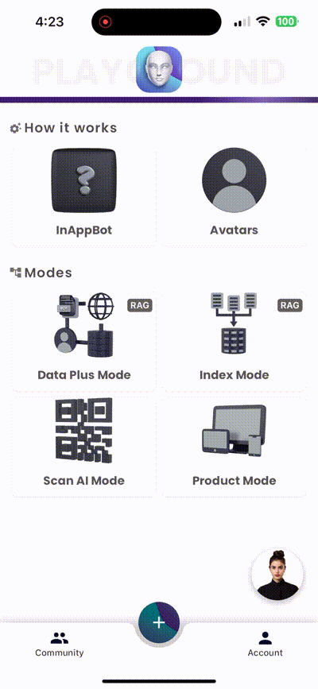
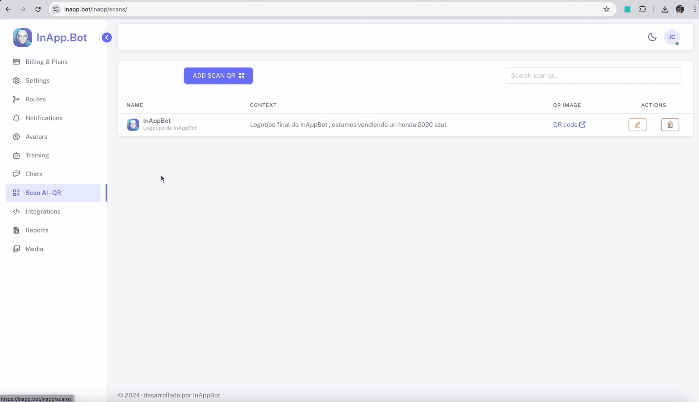
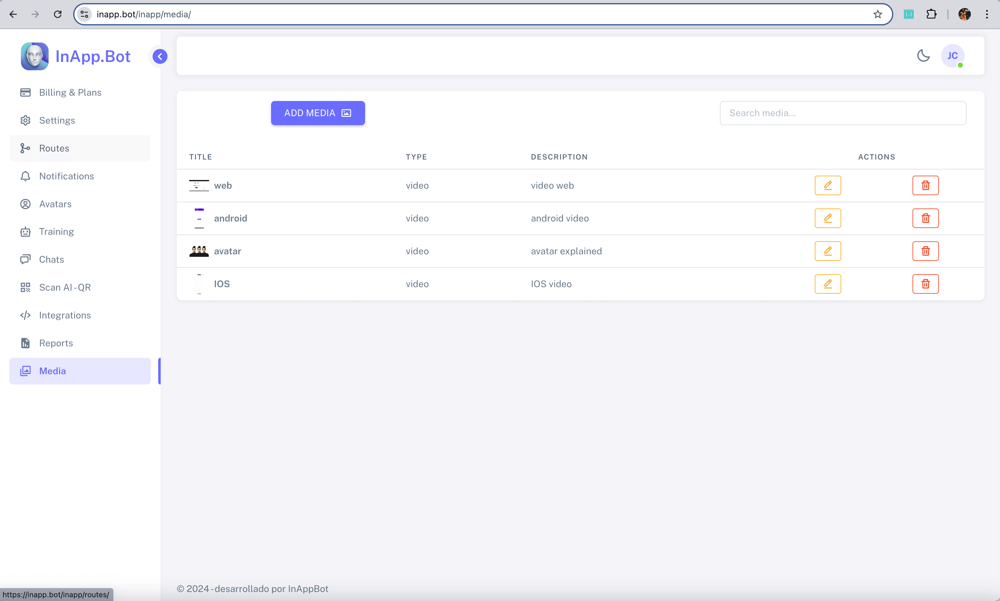
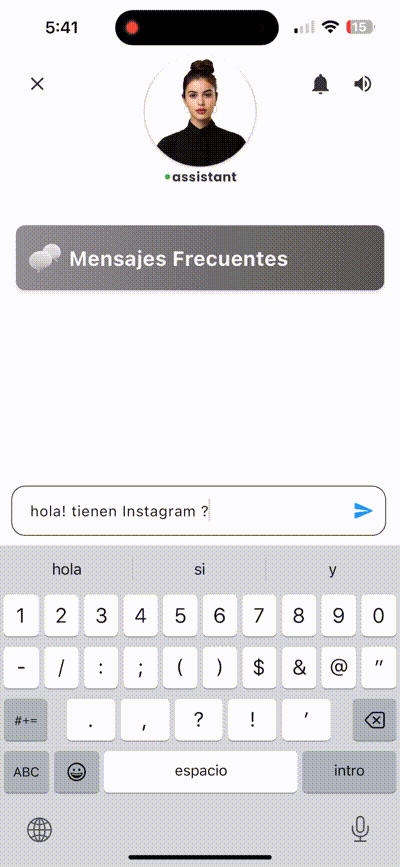
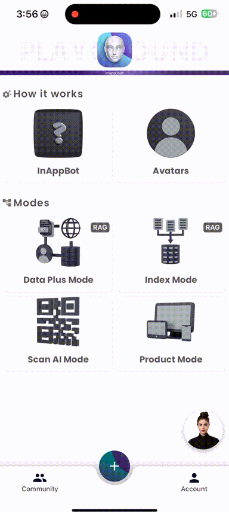
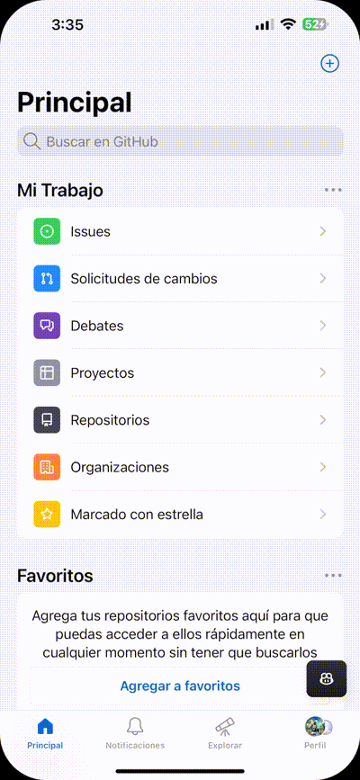

<div align="center">
<a id="up"></a>
  
[English](../../../README.md) • [Español](README_ES.md) • [中文](README_ZH.md) • 日本語 • [हिन्दी](README_HI.md)

</div>

<p align="center">
  <a href="https://inapp.bot">
    
  </a>
</p>

<h1 align="center">
  
</h1>

<h4 align="center">すべてのプラットフォームに統合され、アプリの生産性を向上させるバーチャルアシスタント。</h4>

<p align="center">
  
  <a href="https://github.com/Inappbot/inapp.bot/blob/main/LICENSE">
    
  </a>
  <a href="https://github.com/Inappbot/inapp.bot/stargazers">
    
  </a>
</p>

<p align="center">
    <a href="https://inapp.bot"><b>ウェブサイト</b></a> •
    <a href="https://twitter.com/inappbot"><b>Twitter</b></a> •
    <a href="https://www.youtube.com/@inappbot"><b>Youtube</b></a>
</p>

<p align="center">
 <a href="https://www.youtube.com/watch?v=daEkkwFkm_Q">
  
    </a>
    
  > **InApp.Bot、Gemini APIハッカソンでのプレゼンテーション。**
</p>
<p align="center" style="margin-top: 5px;">
  <a href="https://www.youtube.com/watch?v=daEkkwFkm_Q">
    
  </a>
</p>

## 📖 目次

- [🚀 クイックスタート](#-quick-start)
  - [Playgroundのダウンロード](#download-the-playground)
  - [InApp.Bot v1.0.0](#inappbot-v100)
- [✨ 主な機能](#key-features)
  - [Avatars: アシスタントを生き生きとさせる](#avatars-bringing-the-assistant-to-life)
  - [Text-to-Speech: アシスタントに声を与える](#text-to-speech-giving-voice-to-your-assistant)
  - [管理パネル](#admin-panel-manage-your-assistants)
- [🧠 アシスタントモード](#assistant-modes-discover-the-power-of-each-mode)
  - [Data Plusモード](#1-data-plus-mode)
  - [Indexモード](#2-index-mode)
  - [Scan AIモード](#3-scan-ai-mode)
  - [Productモード](#4-product-mode)
- [🌟 追加機能](#other-features-of-inappbot-assistants)
- [🌐 対応プラットフォーム](#where-inappbot-assistants-can-be-embedded)
- [⚙️ インストールガイド](#how-to-install-on-flutter-apps)
  - [Flutterアプリ](#how-to-install-on-flutter-apps)
  - [iOS、Android、Webアプリ](#how-to-embed-in-ios-android-and-web-apps)
  - [プロフェッショナルインストールサービス](#installation-service-for-ai-assistants-in-your-projects)
  - [開発者向けインストール](#installation-for-developers)
- [🤝 プロジェクトへの貢献](#become-a-contributor-and-shape-the-future-of-inappbot)
- [🌱 InApp.Botを開発する理由](#why-were-building-inappbot)
- [ロードマップ](#roadmap)
- [サポート](#support)
- [ライセンス](#license)


<a id="download-the-playground"></a>

## 🚀 クイックスタート

### Playgroundのダウンロード

<table>
  <tr>
    <th style=" color: black; text-align: center;">iOS</th>
    <th style=" color: black; text-align: center;">Android</th>
  </tr>
  <tr>
    <td align="center">
      <a href="https://testflight.apple.com/join/32hEyxmc">
        
      </a>
    </td>
    <td align="center">
      <a href="https://play.google.com/store/apps/details?id=bot.inapp.inappbot">
        
      </a>
    </td>
  </tr>
  <tr>
    <td align="center">📌 <em>TestFlightを通じて早期アクセス</em></td>
    <td align="center">📌 <em>ベータプログラムに参加</em></td>
  </tr>
</table>

<details>
<summary>📱 クイックインストールガイド</summary>

### iOSセットアップ

1. 上の「Download on the App Store」ボタンをタップします。
2. TestFlightにリダイレクトされます。
3. TestFlightがインストールされていない場合は、App Storeからダウンロードします。
4. アプリのテストを受け入れます。
5. インストールして、体験を開始しましょう！

### Androidセットアップ

1. 「Get it on Google Play」ボタンをクリックします。
2. Playストアのリストに移動します。
3. ベータプログラムに参加します（利用可能な場合）。
4. インストールして、すぐに使い始めましょう！

</details>

<a id="inappbot-v100"></a>

## inapp.bot v1.0.0

InAppBotは、ユーザーとのインタラクションの方法を革新するクロスプラットフォームのバーチャルアシスタントソフトウェアです。この強力なアシスタントは、Flutter、iOS、Android、Webアプリケーションにシームレスに統合でき、ユーザーの問い合わせに応答するだけでなく、個別の推奨やリアルタイムのガイドを提供し、ユーザーの体験を向上させ、ビジネス効率を高めます。オープンソースのソリューションとして、InAppBotは、すべてのインタラクションをカスタマイズできるだけでなく、アプリケーションの特定のニーズに合わせてアシスタントを自由に調整することができます。

<div align="center">
  
  <br>
  <em>Flutterアプリ内のinapp.botアシスタント</em>
</div>

> 👩‍💻 **アプリにスーパー能力を与えるアシスタントを作成しました！**

<details>
<summary><strong>🔍 このバージョンの提供内容を確認しましょう！</strong></summary>

### **🤖 GeminiによるLLM - 可能性の拡大**

- **🚀 高度なAI:** GoogleのGeminiを活用して、最先端の言語理解と生成を実現。
- 🔮 **将来に備える:** 今後のアップデートと強化されたAI機能で、時代の先を行きましょう。
- 🌐 **多言語対応:** 異なる言語や文化を持つユーザーと効果的にコミュニケーション。

### **🚀 Pineconeによるベクターデータベース**

- ⚡ **超高速検索:** 大量のデータから効率的に情報を検索し取得。
- 🔍 **セマンティック検索:** ユーザーの意図を理解し、より正確で文脈に合った応答を提供。
- 📈 **スケーラビリティ:** データセットの拡大に伴い、パフォーマンスを損なうことなく対応可能。

### **💾 Firebaseデータベース**

- 🔐 **セキュアでスケーラブル:** Firebaseは、データの保護とスケーラビリティを保証し、大規模なデータセットの管理もセキュリティを損なうことなく簡単に行えます。
- ☁️ **リアルタイム同期:** プラットフォーム間でリアルタイムにデータを同期し、デバイスに関係なくスムーズなユーザー体験を提供。
- 🛠️ **開発者に優しい:** Firebaseの直感的なセットアップにより、プロジェクトへのデータベースの統合が迅速かつ簡単です。

### **📚 PDF、Web、テキストによるナレッジベース**

- 📊 **多様なソース:** 様々な形式の情報を統合し、包括的なナレッジベースを作成。
- 🔄 **簡単な更新:** 情報を迅速に追加または変更して、アシスタントの知識を最新に保つ。
- 🎯 **ターゲット学習:** 特定の分野やトピックに焦点を当て、アシスタントを専門家に育成。

### **👤 inapp.botによるアバター**

- 🌟 **カスタマイズ可能なビジュアル:** カスタマイズ可能なビデオアバターでアシスタントに生命を吹き込み、ブランドに合ったユーザー体験を提供。
- 👁️ **高品質アニメーション:** リアルなビデオアバターでインタラクションを強化し、ユーザーとの強いつながりを構築。
- 🎭 **ブランドアイデンティティ:** プロジェクトのスタイルに合ったアバターをパーソナライズし、アプリケーションを真にユニークなものにします。

### **🗣️ テキスト読み上げ（TTS）**

- 💰 **完全無料:** デバイスのネイティブTTSエンジンを活用することで、音声合成に追加費用はかかりません。
- 🎧 **デバイス統合:** 外部サービスを必要とせず、デバイス内蔵のTTS機能を使用して最適なパフォーマンスを実現。
- 🌐 **多言語対応:** デバイスの言語設定を活用し、ユーザーの希望する言語でコミュニケーションを取ることができます。

### **🛠️ inapp.botによる管理パネル**

- 🎛️ **完全管理:** データ処理からユーザーとのインタラクションまで、管理パネルを通じてプロジェクトのすべての側面を管理。
- 🚀 **使いやすいインターフェース:** 使いやすさを重視して設計されており、素早く更新や変更が可能。
- 🖥️ **設定コントロール:** 中央から設定や好みをカスタマイズ。

</details>

<h4 align="center"> アシスタントに使用されている技術</h4>
<p align="center">  </p>

<a id="key-features"></a>

## ⭐ 主な機能

<a id="avatars-bringing-the-assistant-to-life"></a>

### 👩‍💻 アバター: アシスタントに生命を吹き込む！

<div align="center">
  <table>
    <tr>
      <td align="center" style="width: 53.8%;">
        
        <br>
        <em>ビデオベース</em>
      </td>
      <td align="center" style="width: 46.2%;">
        
        <br>
        <em>結果</em>
      </td>
    </tr>
  </table>

> 🎥 **私たちはビデオから素晴らしい無料のアバターを統合しています！**
</div>

<details>
<summary><strong>🔍 ビデオをアバターに選んだ理由を発見！</strong></summary>

### **ビデオアバターの力**

InAppBotの開発において、私たちはビデオアバターを主要な機能として組み込む戦略的な選択をしました。理由は次のとおりです：

- 💰 **コスト効果:** 既存のインタラクティブアバターソリューションは、通常かなりのコストがかかります。
- 🤖 **人間らしさ:** 3Dオプションは革新的ですが、リアリズムやつながりに欠けることがよくあります。
- 🌟 **本物らしさ:** ビデオ技術は、より本物で魅力的なユーザー体験を提供します。

### **🚀 利点**

- 🎨 **パーソナライズ:** ブランドアイデンティティを反映するために、独自のビデオアバターをアップロードして選択。
- 🤝 **深いつながり:** ユーザーとのより意味のあるインタラクションを促進。
- 🧠 **記憶に残る体験:** アシスタントとのインタラクションを際立たせ、持続的な印象を与えます。

### **💯 完全無料**

- 🆓 **隠れたコストなし:** ビデオをアップロードしてパーソナライズされたアバターを無料で作成。
- 🧪 **自由な実験:** 予算の制約なしにさまざまなアバターを試すことができます。
- 💼 **あらゆるプロジェクトに最適:** スタートアップでも既存のビジネスでも、InAppBotの機能を活用可能。

</details>

<br>
<br>

<a id="text-to-speech-giving-voice-to-your-assistant"></a>

### 🗣️ テキスト読み上げ: あなたのアシスタントに声を与える

> 🗣️ **We use the TTS of the devices, cost-free** -->
<div align="center">
  
  <br>
  <em>アバターとのTTSのシームレスな統合</em>
</div>

> 🗣️ **デバイスのTTSを使用し、コストはかかりません**


<details>
<summary><strong>🔍 デバイスのTTSを活用して、あなたのアシスタントに命を吹き込む方法を発見—完全無料！</strong></summary>

InAppBotの開発において、デバイスに内蔵されたText-to-Speech (TTS)機能を活用し、シームレスでコストのかからない音声体験を提供しています。その理由は以下の通りです：

- 💰 **完全無料:** デバイスのネイティブTTSエンジンを利用することで、音声合成に追加費用はかかりません。
- 🎧 **デバイス統合:** ネイティブTTS機能を使用することで、外部サービスなしで最適なパフォーマンスを発揮します。
- 🌐 **多言語対応:** デバイスの言語設定を活用し、ユーザーの希望する言語でコミュニケーションします。
- 🔋 **効率的なパフォーマンス:** デバイスに最適化されたネイティブTTSは、バッテリー寿命やリソース管理に優れています。
- 📱 **クロスプラットフォーム互換性:** TTSをサポートするすべてのデバイスやプラットフォームでスムーズに動作します。

</details>

<br>
<br>

<a id="admin-panel-manage-your-assistants"></a>

### 🛠️ 管理パネル: あなたのアシスタントを管理する

<div align="center">
  <table>
    <tr>
      <td align="center">
        
        <br>
        <em>InApp.Botアシスタント向けの無料管理パネル</em>
      </td>
    </tr>
  </table>

> 🛠️ **InApp.Botアシスタント向けに、管理パネルを無料で作成しました。自分で管理パネルを展開する手間を省くため、プレミアムサブスクリプションにアップグレードするオプションも提供しています。**

</div>

<details>
<summary><strong>🔍 管理パネルのすべての機能を発見</strong></summary>

- ⚙️ **設定:** このセクションでは、アシスタントが適切に動作するために必要なすべてのAPIを設定できます。InApp.Botでは、OpenAIやPineconeのAPIキーを保存しません。これらのキーは、設定したFirebaseプロジェクト内に安全に保存され、敏感な情報はあなた自身のインフラ内で保護されます。

<table>
    <tr>
      <td align="center">
        
      </td>
    </tr>
  </table>

- 🗺️ **ルート:** このセクションでは、アプリ内でカスタムルートを追加でき、アシスタントがユーザーに特定のルートを送信しながらシームレスにナビゲートします。この機能により、アシスタントとの対話に基づいてユーザーがアプリをスムーズに利用できるように体験が向上します。

<table>
    <tr>
      <td align="center">
        
      </td>
    </tr>
  </table>

- 🔔 **通知:** このセクションでは、InApp.Botアシスタントを通じてユーザーに通知を送信できます。アシスタントは通知に関する完全なコンテキストを持っており、トピックに関してユーザーに詳細で関連性のある情報を提供できます。

<table>
    <tr>
      <td align="center">
        
      </td>
    </tr>
  </table>

- 👤 **アバター:** このセクションでは、アプリ内のアシスタントとして利用可能なアバターを選択できます。また、自分のカスタムアバターをアップロードするオプションもあり、アシスタントの外見や性格を完全にコントロールできます。

<table>
    <tr>
      <td align="center">
        
      </td>
    </tr>
  </table>

- 🧠 **トレーニング:** このセクションでは、アシスタントに必要な知識をトレーニングして、アプリユーザーを効果的にサポートできます。さらに、アシスタントを駆動するLarge Language Models (LLMs) を設定し、正確で関連性のある応答を提供できるようにします。

<table>
    <tr>
      <td align="center">
        
      </td>
    </tr>
  </table>

- 💬 **チャット:** このセクションでは、アシスタントとアプリユーザー間の会話を表示できます。チャットを削除したり、FAQセクションに追加したり、ユーザーが尋ねていることについてのインサイトを得ることができます。この機能を使用して、ユーザーのニーズをより深く理解し、対応することが可能です。

<table>
    <tr>
      <td align="center">
        
      </td>
    </tr>
  </table>

- 🔍 **Scan Ai:** このセクションでは、Scan AIモードをトレーニングできます。アシスタントが追加したQRコードをスキャンすると、関連する製品に関する知識を得て、ユーザーにその製品について詳細な情報を提供できるようになります。

<table>
    <tr>
      <td align="center">
        
      </td>
    </tr>
  </table>

- 🔗 **インテグレーション:** このセクションでは、InApp.Botアシスタントを既存のアプリに統合する方法に関する情報を提供します。このセクションはまだ開発中ですが、シームレスな統合を確実にするための包括的なガイドが提供される予定です。

<table>
    <tr>
      <td align="center">
        
      </td>
    </tr>
  </table>

- 🖼️ **メディア:** このセクションでは、アシスタントがユーザーに表示するための画像や動画をアップロードできます。この機能により、リッチなマルチメディアコンテンツをアシスタント経由で提供し、ユーザー体験を強化できます。

<table>
    <tr>
      <td align="center">
        
      </td>
    </tr>
  </table>

</details>

<h4 align="center">管理パネルで使用されている技術</h4>
<p align="center">  </p>

<a id="assistant-modes-discover-the-power-of-each-mode"></a>

## 🧠 アシスタントモード: 各モードの力を発見

InAppBotは、さまざまなプラットフォームとニーズに合わせた複数のモードを提供しており、最適なユーザー体験を提供できます。以下は、利用可能なモードとその主要な特徴です。

<a id="1-data-plus-mode"></a>        

#### 1. **Data Plusモード**


<details>
  <summary>クリックして展開</summary>

#### 説明
- **タイプ:** RAG (Retrieval-Augmented Generation)

このモードは、**PDF形式やウェブコンテンツ**を通じて追加の知識を取り入れ、ユーザーとの対話を強化するよう設計されています。ユーザーが質問すると、アシスタントは最初に**ベクターデータベース**を参照し、関連する特定のコンテキストを取得して回答に反映させます。このコンテキストに基づいて、ディープラーニング言語モデル (**LLM**) がパーソナライズされた詳細な回答を生成します。

さらに効率的なのは、クエリごとにベクターデータベースから取得されたコンテキストが更新されるため、すべての蓄積されたコンテキストを毎回LLMに送信する必要がないことです。代わりに、前の質問から得たベクトルコンテキストを次のクエリに明示的に含めなくても、会話が一貫性を保ち続けるように、進化した手法が適用されています。このアプローチは、リソースの使用を最適化し、システムに不要な情報を過剰に負荷させることなく、応答が会話の流れに沿って関連性と一貫性を維持することを保証します。

この戦略により、各応答は最新かつ特定のデータに基づいており、ユーザーとの対話全体を通じて流暢で関連性のあるものとなり、アシスタントの応答の効果を大幅に向上させます。

- **応答速度:** 応答あたり約**3秒**。
- **コスト:** 平均コストは、**1メッセージあたり2,000トークン**を使用した場合、**50,000メッセージ**あたり**$15**です（質問と応答の両方を含む）。

#### テクノロジー
- **LLM:** Gemini 3.5 Flash - Googleが開発した最先端のディープラーニング言語モデルで、正確かつコンテキストに関連した応答を提供します。
- **Pinecone:** 効率的で迅速なデータ保存と取得のためのベクターデータベース。
- **Firebase:** Googleによる安全でスケーラブルなモバイルおよびウェブアプリケーション開発プラットフォーム。
- **埋め込みモデル:** 言葉、フレーズ、文書をベクトルとして表現するディープラーニングモデルで、NLPタスクの基盤となります。
- **ナレッジベース:** **PDFやウェブコンテンツ**のカスタマイズ可能な統合により、アシスタントは特定のドメインに関連した情報で応答します。

#### ユースケース
- **ソフトウェアアプリケーションにおける技術サポート:**
  - **PDF**形式でユーザーマニュアル、インストールガイド、トラブルシューティングドキュメントをアップロードします。
  - アシスタントはこれらのドキュメントに基づいて詳細なコンテキストのある応答を提供します。
- **Eコマースにおけるカスタマーサポート:**
  - 返品ポリシー、製品ガイド、FAQでアシスタントをトレーニングします。
  - ユーザーは、返品や製品の詳細など、正確な情報を受け取ります。
- **具体例:**
  - **your-company-document.pdf**のようなドキュメントでアシスタントをトレーニングします。
  - ユーザーはその内容について質問し、アシスタントの理解度と正確性を評価できます。

</details>

<a id="2-index-mode"></a>

#### 2. **Indexモード**


<details>
  <summary>クリックして展開</summary>

#### 説明
- **タイプ:** RAG (Retrieval-Augmented Generation)

**インデックスモード**は、構造化されたデータへの迅速なアクセスを必要とするアプリケーション内で情報の検索と提供を最適化するために特別に設計されています。このモードは、コンテンツを整理しインデックスを作成することで、仮想アシスタントがユーザーのクエリに基づいて最も関連性の高いセクションを効率的にスキャンし取得できるようにします。

**どのように機能するのか？**

- **コンテンツのインデックス作成:**
  - すべての関連データやドキュメントがシステム内でインデックス化され、簡単にアクセスできるセグメントに分類されます。これは、本の章のような形で整理されます。
- **効率的な検索:**
  - ユーザーが質問をすると、アシスタントはインデックス化された構造を使用して関連するセグメントをスキャンし、正確で文脈に適した回答を提供します。

- **応答速度:** 1回の応答に約**3秒**。
- **コスト:** 平均コストは、**50,000メッセージ**ごとに**$15**で、1メッセージあたり**2,000トークン**を使用します。

#### テクノロジー
- **LLM:** Gemini 3.5 Flash、ユーザーのクエリに対して正確で文脈に適した回答を提供します。
- **Firebase:** 安全で効率的なデータ管理をサポートするバックエンド。
- **ナレッジベース:** 手動や書籍のコレクションのように情報が整理され、簡単にアクセスできるようにインデックス化および構造化されています。

#### 使用例
- **ビジネスナレッジマネジメント:**
  - インデックス化されたビジネスデータに基づいた迅速かつ正確な応答を必要とするアプリケーションに最適です。
  - アシスタントは、知識の「デジタル本」として機能し、手動で整理されたテキストで正確な検索を実現します。
- **使用例:**
  - **Contacts**のようなインデックスを使用して、ビジネス知識をアシスタントに統合します。
  - ユーザーが「会社のメールアドレスは何ですか？」と尋ねると、アシスタントは**Contacts**インデックスを参照して、正確な回答を提供します。

</details>

<a id="3-scan-ai-mode"></a>

#### 3. **Scan AIモード**


<details>
  <summary>クリックして展開</summary>

#### 説明
- **タイプ:** KPCS (Knowledge-Persistent Contextual Scanning)

**Scan AIモード**は、ユーザーが**QRコード**をスキャンするだけで即座に関連する回答を得られるようにすることで、情報アクセスの方法を革新します。ドキュメントを探す代わりに、ユーザーは瞬時に情報にアクセスできます。

**どのように機能するのか？**

- **QRコードの生成:**
  - 管理パネルからデータセットやドキュメント用の特定のQRコードを生成します。
- **QRコードのスキャン:**
  - ユーザーはQRコードをスキャンすると、アシスタントが関連する情報をすべて抽出します。
- **知識への即時アクセス:**
  - アシスタントはすぐにユーザーの質問に迅速かつ効率的に応答し、正確で文脈に適した回答をリアルタイムで提供します。

- **応答速度:** 1回の応答に約**2秒**。
- **コスト:** 平均コストは、**50,000メッセージ**ごとに**$15**で、1メッセージあたり**2,000トークン**を使用します。

#### テクノロジー
- **LLM:** Gemini 3.5 Flash、正確で文脈に適した回答を提供します。
- **Firebase:** QRコード経由で迅速に知識を取得するためにデータを保存します。
- **ナレッジベース:** QRスキャンを介してアクセスできるカスタマイズされた情報で、製品やトピックに関する質問に最適です。

#### 使用例
- **レンタカー:**
  - レンタカーの車内にQRコードを設置。
  - ユーザーはコードをスキャンして、詳細な車両情報、ユーザーマニュアル、メンテナンス情報を受け取ります。
- **製品マニュアル:**
  - 製品にQRコードを配置して、製品の詳細に即座にアクセスできるようにします。
  - アシスタントは、マニュアルを読む必要なく、特定の情報を提供します。

</details>


<a id="4-product-mode"></a>

#### 4. **Productモード**


<details>
  <summary>クリックして展開</summary>

#### 説明
- **タイプ:** DDDS (Data-Driven Dialogue System)

このモードは、詳細な製品情報を提供する必要があるアプリケーション向けに設計されています。アプリ所有者は製品ページに直接製品の詳細をアップロードでき、バーチャルアシスタントはこのデータを使用してユーザーの問い合わせに効率的かつ正確に応答します。

特定の製品仕様、特徴、FAQへの直接アクセスを持つことで、アシスタントはユーザーのクエリに即時に、正確で、文脈に応じた回答を提供し、ショッピング体験を向上させます。

- **応答速度:** 1応答あたり約**2秒**。
- **コスト:** 平均コストは**50,000メッセージ**あたり**$15**、1メッセージあたり**2,000トークン**を使用します。

#### 使用技術
- **LLM:** Gemini 3.5 Flash、ユーザークエリに正確かつカスタマイズされた応答を生成します。
- **ナレッジベース:** 製品の詳細（仕様、特徴、FAQなど）はアプリ所有者がアップロードして管理します。

#### ユースケース
- **Eコマース:**
  - 製品ページ上でリアルタイムに詳細な製品クエリに応答します。
  - ユーザーは製品の容量、特徴、動作モードなどを尋ねることができます。
- **カスタマーサポート:**
  - 一貫性があり、正確な製品情報を提供します。
  - 消費者の信頼を向上させ、コンバージョン率を高める可能性があります。

</details>

<a id="other-features-of-inappbot-assistants"></a>

## 🌟 InApp.Botアシスタントのその他の機能

InApp.Botアシスタントには、次のような強力な機能が搭載されています：

- **頻繁なメッセージ:** よくあるユーザーの問い合わせに対して事前定義された応答を提供し、迅速で効率的なコミュニケーションを実現します。
- **WhatsAppリンクを送信:** アプリから直接ユーザーにWhatsAppリンクをシームレスに送信し、ユーザーエンゲージメントを向上させます。
- **Instagramリンクを送信:** Instagramリンクをユーザーと共有し、アシスタント内でソーシャルメディア体験を統合します。
- **アプリ内リンクを送信:** アプリ内の特定の部分にユーザーを誘導し、ナビゲーションやユーザーインタラクションを強化します。
- **プロモーションコードを送信:** プロモーションコードをユーザーと簡単に共有し、エンゲージメントとリワードを促進します。
- **ビデオを送信:** ユーザーにビデオを共有し、視覚コンテンツを通じてコミュニケーション体験を強化します。
- **画像を送信:** ユーザーに画像を送信し、アシスタントの応答に視覚的な要素を追加します。

<p align="center">
  
  
  
</p>

<a id="where-inappbot-assistants-can-be-embedded"></a>

## 🌐 InApp.Botアシスタントが埋め込める場所

InApp.BotアシスタントはFlutterで構築されており、さまざまなプラットフォームに柔軟に対応することができます：

- 💻 **Flutterアプリ:**  
  InApp.BotはFlutterでネイティブに構築されており、アシスタントはAndroid、iOS、ウェブ用のクロスプラットフォームアプリに埋め込むことができます。  
  **テスト進捗状況:** 🟩🟩🟩🟩🟩🟩🟨 90%

- 🍏 **iOSアプリ:**  
  InApp.BotアシスタントはiOSアプリに埋め込むことができます。  
  **テスト進捗状況:** 🟩🟩🟩🟨⬜⬜⬜ 40%

- 🤖 **Androidアプリ:**  
  InApp.BotアシスタントはAndroidアプリケーションに埋め込むことができます。  
  **テスト進捗状況:** 🟩🟩🟩🟨⬜⬜⬜ 40%

- 🌐 **ウェブアプリ:**  
  InApp.Botアシスタントはウェブアプリケーションに埋め込むことができます。  
  **テスト進捗状況:** 🟩🟩🟩🟨⬜⬜⬜ 40%

モバイルアプリ、ウェブアプリ、またはクロスプラットフォームソリューションを構築している場合でも、InApp.Botはすべての主要なプラットフォームでインテリジェントなアシスタント機能を提供できます。

<details>
<summary><strong>🔍 プラットフォームの例を見る</strong></summary>

<p align="center">
  
  
  
</p>
<p align="center">
  
</p>

</details>

   <a id="how-to-install-on-flutter-apps"></a>

## 📁 Flutterアプリへのインストール方法

<div align="center">
  <table>
    <tr>
      <td align="center">
        
        <br>
        <em>InApp.BotをFlutterアプリにシームレスに統合</em>
      </td>
    </tr>
  </table>

> ⚙️ **以下の手順に従って、簡単にFlutterプロジェクトにInApp.Botを統合できます:**

</div>

FlutterプロジェクトにInApp.Botアシスタントを統合するには、以下の簡単な手順に従ってください：

1. **`lib`ディレクトリに`in_app_bot`フォルダを追加**:  
   既存のFlutterプロジェクトの`lib`ディレクトリに`in_app_bot`フォルダをコピーします。

2. **依存関係を更新**:  
   `pubspec.yaml`ファイルを開き、InApp.Botに必要なパッケージを含めるために以下の依存関係を追加します：

   ```yaml
   dependencies:
     cached_network_image: ^3.2.3
     cloud_firestore: ^5.2.1
     equatable: ^2.0.5
     file_picker: ^6.1.1
     firebase_auth: ^5.1.4
     firebase_core: ^3.3.0
     firebase_storage: ^12.1.3
     flutter:
       sdk: flutter
     flutter_localization: ^0.1.14
     flutter_riverpod: ^2.4.0
     flutter_secure_storage: ^9.2.2
     flutter_spinkit: ^5.2.0
     flutter_tts: ^4.0.2
     font_awesome_flutter: ^10.7.0
     google_generative_ai: ^0.4.3
     google_sign_in: ^6.1.5
     http: ^1.1.0
     intl: ^0.19.0
     langchain_openai: ^0.3.0
     lottie: ^2.6.0
     path: ^1.8.3
     path_provider: ^2.1.1
     pinecone: ^0.7.2
     qr_code_scanner: ^1.0.1
     share_plus: ^7.2.2
     shared_preferences: ^2.2.3
     sqflite: ^2.3.0
     url_launcher: ^6.2.0
     uuid: ^4.2.1
     video_player: ^2.8.2
     flutter_dotenv: ^5.1.0
   ```

3. **Firebaseで関数を作成**:
   `functions`フォルダーにあるコードを使用して、Firebaseで関数を作成します。これらがアプリケーションで使用されるエンドポイントとなります。

4. **環境変数の設定**:
   プロジェクトのルートに`.env`ファイルを作成し、以下の環境変数を含めます：

   ```
   API_ENDPOINT=<あなたの_OPENAI_および_PINECONE_APIキー_エンドポイント>
   GEMINI_API_KEY=<あなたの_GEMINI_APIキー_エンドポイント>
   PINECONE_INDEX_NAME=<あなたの_PINCONEインデックス名>
   PINECONE_PROJECT_ID=<あなたの_PINCONEプロジェクトID>
   PINECONE_TOP_K=<TOP_K値>
   PINECONE_BASE_URL=<あなたの_PINECONE_ベースURL>
   ```

5. **アプリ内でアシスタントを呼び出す**:  
   希望するモードでアシスタントを使用するには、`in_app_bot/lib/playground/presentation/widgets/play_row_widget.dart`内の例を参照してください。

   **注目コード: アシスタントモードの設定**
   ```dart
   final currentModeProvider = StateProvider<ChatMode>((ref) => ChatMode.dataplusMode);
   ```

   次に、このプロバイダーをアプリ内で使用して、アシスタントを正しいモードで設定し、呼び出すことができます。

<a id="how-to-embed-in-ios-android-and-web-apps"></a>

## iOS、Android、およびWebアプリへの埋め込み方法

iOS、Android、またはWebアプリケーションにInApp.Botを埋め込むには、公式のFlutter「Add to App」ガイドに従ってください：[Flutter Add-to-App Documentation](https://docs.flutter.dev/add-to-app).

<a id="installation-service-for-ai-assistants-in-your-projects"></a>

## 🛠️✨ inapp.botアシスタントのプロジェクトへのインストールサービス

**InApp.Bot**では、強力なバーチャルアシスタントソリューションを提供するだけでなく、既存のアプリケーションにAIアシスタントをシームレスに統合するための**パーソナライズされたインストールサービス**も提供しています。あなたのプロジェクトが**Flutter、iOS、Android**、または**Webプラットフォーム**で構築されているかどうかにかかわらず、私たちの経験豊富な開発者チームが全体のセットアッププロセスを担当し、アシスタントがスムーズかつ効率的に組み込まれるようにします。

インストールサービスを検討すべき理由は以下の通りです：

- **手間のかからない統合**: 複雑な設定や技術的な詳細は私たちに任せて、ビジネスの成長に集中できるようにします。
  
- **ニーズに合わせたカスタマイズ**: すべてのアプリケーションは独自であり、私たちはプロジェクトの特定のニーズに合わせて統合プロセスを調整します。カスタム機能、特別な設定、強化されたAI機能が必要な場合でも、アシスタントがあなたの環境で完璧に動作するようにします。

- **生産性の向上**: アシスタントをインストールすることで、ユーザーインタラクションを強化し、応答を自動化し、リアルタイムサポートを提供します。これにより、生産性とユーザー満足度が向上します。

- **アプリの将来性を確保**: 定期的なアップデートと高度なAI機能により、私たちのアシスタントはアプリケーションと共に進化し、長期的なスケーラビリティと効果を保証します。

インストールサービスを利用することで、アプリに知的な自動化をもたらすために必要な専門知識と安心を提供します。ユーザー体験を革新する次のステップとして、**迅速かつシームレスなインストール**のために、私たちのチームにご連絡ください！

私たちのAIアシスタントの利便性とパワーを体験すれば、きっと後悔はしないでしょう。

お問い合わせは以下までどうぞ：  
📧 **jesuscastillo@inapp.bot**

<a id="installation-for-developers"></a>

## 開発者向けインストール

```bash
# Clone the repository
$ git clone https://github.com/Inappbot/inapp.bot.git

# Install dependencies
$ flutter pub get

# Run the app
$ flutter run
```
<a id="become-a-contributor-and-shape-the-future-of-inappbot"></a>

## 🤝 InApp.Botの未来を形作るコントリビューターになろう

InApp.Botに貢献することで、AIアシスタントの未来を共に形作る世界的な成長チームに参加することができます。あなたの貢献は、世界中のアプリケーションで使用される最先端技術の開発に直接影響を与えることになります。

コントリビューターとして、他の先進的な開発者と協力し、スキルを向上させ、inapp.botの進化において重要な役割を果たす機会を得ることができます。私たちは共に、InApp.Botをよりスマートに、適応力のある、そして強力なツールにしています。

### コントリビューターへの特典
すべてのコントリビューターは、すでに稼働しているInApp.Botの管理パネルの**無料プレミアムアカウント**を受け取ります。このプレミアムアカウントでは、AIアシスタントを完全に制御・カスタマイズでき、最高のユーザー体験を提供するための高度な機能やツールにアクセスできます。

プレミアムアカウントの期間は、貢献のレベルに応じて決定されます：
- **重要な貢献**（機能開発、重大なバグ修正、大規模なドキュメント更新など）は、**1年間**のプレミアムアクセスが付与されます。
- **小さな貢献**（軽微なバグ修正、改善、コードレビューなど）は、より短い期間のプレミアムアクセスが付与されます。

このようにして、すべての貢献に対して報酬が与えられ、プロジェクトへの影響力のある関与が奨励されます。

### コントリビューター紹介

私たちは、InApp.Botの未来を形作るために尽力しているコントリビューターのコミュニティを誇りに思っています。ぜひこのエキサイティングな旅に参加してください！

<a href="https://github.com/Inappbot/inapp.bot/graphs/contributors">
  
</a>

### コントリビューション方法

- **Pullリクエストの提出**: コードを改善したり、機能を追加したり、バグを修正したりしましょう。
- **Issueの提出**: プロジェクトの問題を特定したり、新しいアイデアを提案したりしましょう。
- **ドキュメントの執筆**: ドキュメントを改善して、他の人がプロジェクトに貢献したり使用したりしやすくしましょう。
- **プロジェクトの共有**: ネットワークでプロジェクトを共有したり、ソーシャルメディアで紹介したりしましょう。

あなたの貢献は、inapp.botアシスタントの未来に永続的な影響を与えます。参加していただけることを心からお待ちしています！

<a id="why-were-building-inappbot"></a>
## 🌱 なぜInApp.Botを作っているのか

InApp.Botは、Flutterを学ぶ個人的な挑戦として始まりました。10年間プログラミングをしていなかった私は、車のレンタルアプリを開発するためにフリーランサーを雇いました。しかし、1年以上待っても進展がなかったため、自分で手に負うことにしました。Flutterを学び始めましたが、チュートリアルを追うのは自分のスタイルではなく、実践で学ぶのが最も効果的だと気付きました。

そこで、AIの力を発見しました。ChatGPT、Claude、Geminiのようなツールが私のメンターとなり、コンセプトを説明し、コードを書く手助けをしてくれました。たった1週間で、フリーランサーが作業していたプロジェクトのためにAIアシスタントを作成することができました。AIの助けを借りてこれほどの成果を達成できるとは思っていなかったので、このプロジェクトにすべての自由な時間を注ぎ込むことにしました。

さらに進めていく中で、AIアシスタントが導いてくれたおかげで、Flutterアプリをネイティブアプリに埋め込むことができるということを学びました—それまで知りませんでした。この発見に興奮して、Flutterコミュニティでプロジェクトを共有しました。30件の否定的なコメントを受けましたが、その中の1つが目に留まりました。それは、スケーラビリティに焦点を当てるようにアドバイスしてくれたものでした。数字を確認した結果、元のプロジェクトはスケーラブルではないことに気付き、プロジェクトを断念しました。

数ヶ月後、スケーラブルなAIアシスタントを作るという新たな焦点でそのアイデアに戻ってきました。今回は、ChatGPT、Claude、Geminiの助けを借りて、**InApp.BotのMVPを完成**させることができました。今、私はコミュニティと協力して、最も先進的でオープンソースのAIアシスタントを作り上げたいと考えています。

私が始めた頃は、主要なテック企業の中でAIをアプリに統合しているところはほとんどありませんでした。今日では、Amazon、WhatsApp、GitHubのような大企業が自社のアシスタントで先頭に立っています。以下のGIFでは、これらのアプリに埋め込まれたAIアシスタントを見ることができます：

<p align="center">
  
  
  
</p>

私たち全員が自分たちのプロジェクトにAIアシスタントを持つ時が来ました。共に、これらの強力なツールを誰でもアクセスできるようにする未来を築きましょう。**InApp.Bot**は私だけのプロジェクトではありません—**私たちのプロジェクト**です。自分のプロジェクトに集中しつつ、**InApp.Botアシスタント**を構築してアプリを強化していきましょう。

素晴らしいものを作り上げましょう—**オープンで、スケーラブルで、コミュニティの力で**。

<a id="roadmap"></a>

## ロードマップ

- [x] 初期リリース
- [x] Gemini APIとの統合
- [x] 管理パネルの作成
- [ ] ドキュメントの作成
- [ ] OpenAI APIとの統合
- [ ] 音声コマンドのサポート
- [ ] APIを通じた音声の実装
- [ ] テーマ作成
- [ ] シークレット機能の実装

<a id="support"></a>

## サポート

<a href="https://buymeacoffee.com/jesus89x2w" target="_blank"></a>

<a id="license"></a>

## ライセンス

MITライセンスの下で配布されています。詳細はLICENSEをご覧ください。

---

<p align="center">
  inapp.botチームによって❤️を込めて開発
  <br><br>
  <a href="https://github.com/Inappbot/inapp.bot-admin">
    
  </a>
</p>

<td align="center">
  <a href="#up">
    
  </a>
</td>