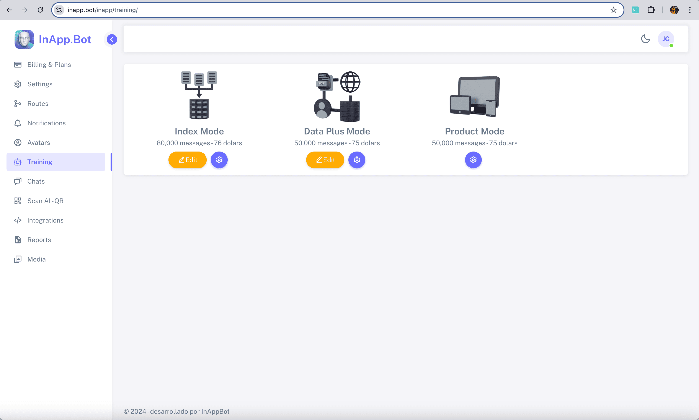
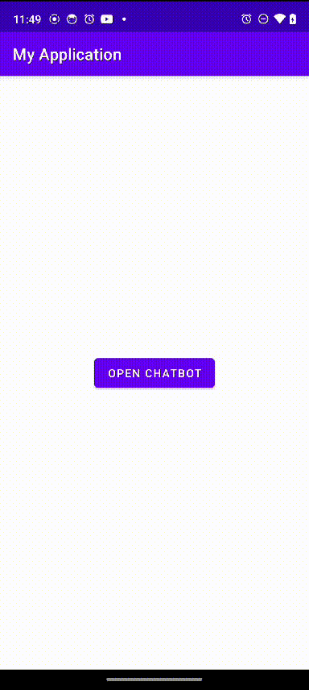
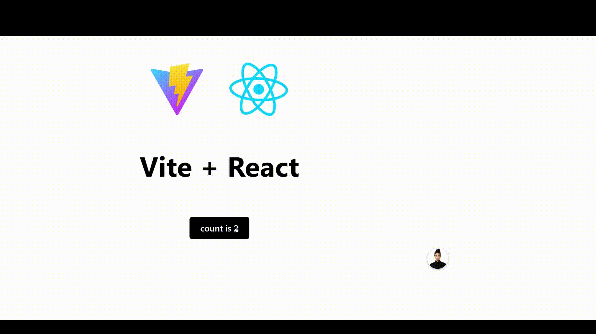

<div align="center">
<a id="up"></a>
  
[English](../../../README.md) • [Español](README_ES.md) • 中文 • [日本語](README_JA.md) • [हिन्दी](README_HI.md)

</div>

<p align="center">
  <a href="https://inapp.bot">
    
  </a>
</p>

<h1 align="center">
  
</h1>

<h4 align="center">虚拟助理集成于所有平台，提升您的应用程序生产力。</h4>

<p align="center">
  
  <a href="https://github.com/Inappbot/inapp.bot/blob/main/LICENSE">
    
  </a>
  <a href="https://github.com/Inappbot/inapp.bot/stargazers">
    
  </a>
</p>

<p align="center">
    <a href="https://inapp.bot"><b>官网</b></a> •
    <a href="https://twitter.com/inappbot"><b>Twitter</b></a> •
    <a href="https://www.youtube.com/@inappbot"><b>Youtube</b></a>
</p>

<p align="center">
 <a href="https://www.youtube.com/watch?v=daEkkwFkm_Q">
  
    </a>
    
  > **InApp.Bot 在 Gemini API 黑客松上的演讲。**
</p>
<p align="center" style="margin-top: 5px;">
  <a href="https://www.youtube.com/watch?v=daEkkwFkm_Q">
    
  </a>
</p>

## 📖 目录

- [🚀 快速入门](#-quick-start)
  - [下载 Playground](#download-the-playground)
  - [InApp.Bot v1.0.0](#inappbot-v100)
- [✨ 主要功能](#key-features)
  - [虚拟形象：赋予您的助理生命](#avatars-bringing-the-assistant-to-life)
  - [文字转语音：为您的助理赋予声音](#text-to-speech-giving-voice-to-your-assistant)
  - [管理面板](#admin-panel-manage-your-assistants)
- [🧠 助理模式](#assistant-modes-discover-the-power-of-each-mode)
  - [Data Plus 模式](#1-data-plus-mode)
  - [Index 模式](#2-index-mode)
  - [Scan AI 模式](#3-scan-ai-mode)
  - [产品模式](#4-product-mode)
- [🌟 额外功能](#other-features-of-inappbot-assistants)
- [🌐 兼容平台](#where-inappbot-assistants-can-be-embedded)
- [⚙️ 安装指南](#how-to-install-on-flutter-apps)
  - [Flutter 应用](#how-to-install-on-flutter-apps)
  - [iOS、Android 和 Web 应用](#how-to-embed-in-ios-android-and-web-apps)
  - [专业安装服务](#installation-service-for-ai-assistants-in-your-projects)
  - [开发者安装](#installation-for-developers)
- [🤝 贡献项目](#become-a-contributor-and-shape-the-future-of-inappbot)
- [🌱 我们为什么构建 InApp.Bot](#why-were-building-inappbot)
- [路线图](#roadmap)
- [支持](#support)
- [许可证](#license)

<a id="download-the-playground"></a>

## 🚀 快速入门

### 下载 Playground

<table>
  <tr>
    <th style=" color: black; text-align: center;">iOS</th>
    <th style=" color: black; text-align: center;">Android</th>
  </tr>
  <tr>
    <td align="center">
      <a href="https://testflight.apple.com/join/32hEyxmc">
        
      </a>
    </td>
    <td align="center">
      <a href="https://play.google.com/store/apps/details?id=bot.inapp.inappbot">
        
      </a>
    </td>
  </tr>
  <tr>
    <td align="center">📌 <em>通过 TestFlight 提前访问</em></td>
    <td align="center">📌 <em>加入我们的测试计划</em></td>
  </tr>
</table>

<details>
<summary>📱 快速安装指南</summary>

### iOS 设置

1. 点击上面的“在 App Store 下载”按钮。
2. 您将被重定向到 TestFlight。
3. 如果未安装，请从 App Store 下载 TestFlight。
4. 接受邀请以测试我们的应用程序。
5. 安装并开始您的旅程！

### Android 设置

1. 点击“在 Google Play 下载”按钮。
2. 您将进入我们的 Play 商店列表。
3. 加入测试计划（如有）。
4. 安装并开始探索吧！

</details>

<a id="inappbot-v100"></a>

## inapp.bot v1.0.0

InAppBot 是一款跨平台的虚拟助理软件，彻底改变了您与用户互动的方式。这个强大的助理旨在无缝集成到 Flutter、iOS、Android 和 Web 应用中，不仅可以响应用户的询问，还能实时提供个性化推荐和引导，提升用户体验并提高您的业务效率。作为一个开源解决方案，InAppBot 不仅允许您自定义每一次互动，还赋予您根据应用的具体需求定制助理的自由。

<div align="center">
  
  <br>
  <em>flutter 应用中的 inapp.bot 助理</em>
</div>

> 👩‍💻 **我们创建了一个助理，为您的应用赋予超级能力！**

<details>
<summary><strong>🔍 了解此版本的功能！</strong></summary>

### **🤖 LLM by Gemini - 拓展可能性**

- **🚀先进的 AI：** 利用 Google 的 Gemini 强大的语言理解和生成技术。
- 🔮 **未来保障：** 通过即将推出的更新和增强的 AI 功能，保持领先。
- 🌐 **多语言支持：** 与不同语言和文化的用户有效沟通。

### **🚀 Pinecone 向量数据库**

- ⚡ **极速检索：** 高效地从海量数据中搜索和检索信息。
- 🔍 **语义搜索：** 理解用户意图，提供更准确的上下文响应。
- 📈 **可扩展性：** 轻松处理不断增长的数据集，同时保持性能不受影响。

### **💾 Firebase 数据库**

- 🔐 **安全且可扩展：** Firebase 确保您的数据安全且可扩展，轻松管理大数据集而不影响安全性。
- ☁️ **实时同步：** 实时同步跨平台数据，为用户提供流畅的体验，无论使用何种设备。
- 🛠️ **开发者友好：** 通过 Firebase 直观的设置，快速无忧地将数据库集成到您的项目中。

### **📚 知识库：通过 PDF、网页和文本**

- 📊 **多样化来源：** 集成来自不同格式的信息，创建一个全面的知识库。
- 🔄 **轻松更新：** 快速添加或修改信息，确保助理的知识保持最新。
- 🎯 **定向学习：** 专注于特定领域或主题，使助理成为该领域的专家。

### **👤 inapp.bot 的虚拟形象**

- 🌟 **可定制的视觉效果：** 通过可定制的视频虚拟形象赋予助理生命，增强用户体验并反映您的品牌。
- 👁️ **高质量动画：** 使用逼真的视频虚拟形象提升互动效果，加强与用户的联系。
- 🎭 **品牌标识：** 根据项目的风格个性化虚拟形象，使您的应用独具特色。

### **🗣️ 文字转语音 (TTS)**

- 💰 **完全免费：** 通过使用设备的本地 TTS 引擎，语音合成无需额外费用。
- 🎧 **设备集成：** 使用内置的 TTS 功能以获得最佳性能，无需外部服务。
- 🌐 **多语言支持：** 利用设备的语言设置，以用户偏好的语言进行交流。

### **🛠️ inapp.bot 的管理面板**

- 🎛️ **全面控制：** 通过简化的管理面板管理项目的各个方面，从数据处理到用户交互。
- 🚀 **用户友好的界面：** 设计简洁易用，让您快速进行更新和更改。
- 🖥️ **设置控制：** 从中央位置自定义设置和偏好。

</details>

<h4 align="center"> 助理中使用的技术</h4>
<p align="center">  </p>

<a id="key-features"></a>

## ⭐ 主要功能

<a id="avatars-bringing-the-assistant-to-life"></a>

### 👩‍💻 虚拟形象：赋予助理生命！

<div align="center">
  <table>
    <tr>
      <td align="center" style="width: 53.8%;">
        
        <br>
        <em>视频基础</em>
      </td>
      <td align="center" style="width: 46.2%;">
        
        <br>
        <em>结果</em>
      </td>
    </tr>
  </table>

> 🎥 **我们从视频中集成了令人惊叹的、免费的虚拟形象！**
</div>


<details>
<summary><strong>🔍 了解我们为何选择视频作为虚拟形象！</strong></summary>

### **视频虚拟形象的力量**

在开发 InAppBot 时，我们做出了将视频虚拟形象作为核心功能的战略选择。原因如下：

- 💰 **性价比高：** 现有的互动虚拟形象解决方案往往价格高昂。
- 🤖 **人性化接触：** 虽然 3D 选项很创新，但往往缺乏视频带来的现实感和联系。
- 🌟 **真实感：** 视频技术为用户提供了更真实、更有吸引力的体验。

### **🚀 好处**

- 🎨 **个性化：** 上传并选择您自己的视频虚拟形象，反映您的品牌形象。
- 🤝 **更深的连接：** 与您的受众建立更有意义的互动。
- 🧠 **难忘的体验：** 让您的助理互动脱颖而出，留下深刻的印象。

### **💯 完全免费**

- 🆓 **无隐藏费用：** 上传您的视频并创建个性化虚拟形象，完全免费。
- 🧪 **自由实验：** 测试不同的虚拟形象，无需预算限制。
- 💼 **适合任何项目：** 无论您是初创公司还是成熟企业，都可以利用 InAppBot 的功能。

</details>

<br>
<br>

<a id="text-to-speech-giving-voice-to-your-assistant"></a>

### 🗣️ 文字转语音：为您的助理赋予声音

<div align="center">
  
  <br>
  <em>与虚拟形象无缝集成的 TTS</em>
</div>

> 🗣️ **我们使用设备的 TTS，完全免费**

<details>
<summary><strong>🔍 了解我们如何利用设备的 TTS 为您的助理赋予生命——完全免费！</strong></summary>

在开发 InAppBot 时，我们利用了设备内置的文字转语音 (TTS) 功能，为用户提供了无缝且免费的语音体验。原因如下：

- 💰 **完全免费：** 通过利用设备的原生 TTS 引擎，语音合成无需额外成本。
- 🎧 **设备集成：** 使用内置的 TTS 功能，提供最佳性能，无需外部服务。
- 🌐 **多语言支持：** 利用设备的语言设置，以用户的首选语言进行沟通。
- 🔋 **高效性能：** 原生 TTS 针对设备进行了优化，确保更好的电池寿命和资源管理。
- 📱 **跨平台兼容：** 在支持 TTS 的所有设备和平台上运行顺畅。

</details>

<br>
<br>

<a id="admin-panel-manage-your-assistants"></a>

### 🛠️ 管理面板：管理您的助理

<div align="center">
  <table>
    <tr>
      <td align="center">
        
        <br>
        <em>免费的 InApp.Bot 助理管理面板</em>
      </td>
    </tr>
  </table>

> 🛠️ **我们为 InApp.Bot 助理创建了免费的管理面板，您也可以选择升级到高级订阅，避免自行部署管理面板。**

</div>

<details>
<summary><strong>🔍 探索管理面板提供的一切功能</strong></summary>

- ⚙️ **设置:** 在此部分，您可以配置所有必要的 API 以确保助理正常工作。InApp.Bot 不存储 OpenAI 或 Pinecone API 密钥。这些密钥将安全地存储在您配置的 Firebase 项目中，确保您的敏感信息受控并在您的基础设施内得到保护。

<table>
    <tr>
      <td align="center">
        
      </td>
    </tr>
  </table>

  - 🗺️ **路由:** 在此部分，您可以在应用中添加自定义路由，使助理能够无缝导航并向用户发送特定的路由。此功能通过根据用户与助理的互动引导他们操作应用，增强用户体验。

<table>
    <tr>
      <td align="center">
        
      </td>
    </tr>
  </table>

- 🔔 **通知:** 在此部分，您可以通过 InApp.Bot 助理向用户发送通知。这些助理将掌握通知的上下文信息，从而为用户提供详细且相关的主题信息。

<table>
    <tr>
      <td align="center">
        
      </td>
    </tr>
  </table>

- 👤 **虚拟形象:** 在此部分，您可以从现有的虚拟形象中选择作为应用的助理。您还可以上传自定义虚拟形象，完全控制助理的外观和个性。

<table>
    <tr>
      <td align="center">
        
      </td>
    </tr>
  </table>

- 🧠 **训练:** 在此部分，您可以为助理提供必要的知识，以便有效地支持应用用户。此外，您可以配置为助理提供动力的大型语言模型（LLM），确保它们提供准确且相关的回答。

<table>
    <tr>
      <td align="center">
        
      </td>
    </tr>
  </table>

- 💬 **聊天:** 在此部分，您可以查看助理与应用用户之间的对话。您可以删除聊天内容，将它们添加到常见问题（FAQ）部分，并深入了解用户的提问。这一功能使您能够更好地了解和满足用户需求。

<table>
    <tr>
      <td align="center">
        
      </td>
    </tr>
  </table>

- 🔍 **Scan AI:** 在此部分，您可以训练 Scan AI 模式。当助理扫描您添加的二维码时，它们会获取与产品相关的知识，帮助用户提供有关该产品的详细信息。

<table>
    <tr>
      <td align="center">
        
      </td>
    </tr>
  </table>

- 🔗 **集成:** 在此部分，您可以找到如何将 InApp.Bot 助理集成到现有应用中的信息。此部分仍在开发中，但将提供全面的指南，以确保无缝集成。

<table>
    <tr>
      <td align="center">
        
      </td>
    </tr>
  </table>  

- 🖼️ **媒体:** 在此部分，您可以为助理上传图片和视频以展示给用户。此功能通过向用户提供丰富的多媒体内容来增强用户体验。

<table>
    <tr>
      <td align="center">
        
      </td>
    </tr>
  </table>   

</details>

<h4 align="center">管理面板中使用的技术</h4>
<p align="center">  </p>

<a id="assistant-modes-discover-the-power-of-each-mode"></a>

## 🧠 助理模式：探索每种模式的强大功能

InAppBot 提供了多种模式，针对不同的使用场景进行优化，确保您可以在各种平台和需求中提供最佳的用户体验。以下是可用的模式及其关键功能：

<a id="1-data-plus-mode"></a>        

#### 1. **Data Plus 模式**


<details>
  <summary>点击展开</summary>

#### 描述
- **类型:** RAG (检索增强生成)

此模式旨在通过**PDF 格式和网络内容**为用户交互提供更多知识。当用户提出问题时，助理首先查阅**向量数据库**，以检索相关且具体的上下文来生成回复。在此基础上，深度学习语言模型（**LLM**）生成个性化且详细的回答。

这一过程的高效之处在于，向量数据库检索的上下文在每次查询时都会刷新，无需在每次交互中将所有累积的上下文发送给 LLM。相反，采用一种高级方法，即使前一个问题的向量上下文未明确包含在下一个查询中，仍然能保持对话的一致性和连贯性。这种方法优化了资源的使用，确保回复与对话流保持相关性，同时避免系统负载过重。

这种策略不仅保证每次回复由最新且具体的数据支持，还确保整个用户交互过程中的流畅性和相关性，大大提高了助理回复的有效性。

- **响应速度:** 每次回复约 **3 秒**。
- **成本:** 每 **50,000 条消息**（包括问题和回复）平均成本为 **$15**，基于每条消息使用 **2,000 个 tokens**。

#### 技术
- **LLM:** Gemini 3.5 Flash，由 Google 开发的先进深度学习语言模型，能够提供精确且上下文相关的回答。
- **Pinecone:** 用于高效数据存储和检索的向量数据库。
- **Firebase:** Google 提供的安全、可扩展的移动和 Web 应用开发平台。
- **嵌入模型:** 用于表示单词、短语和文档的向量的深度学习模型，是自然语言处理任务的基础。
- **知识库:** 支持**PDF 和网页内容**的自定义集成，使助理能够提供特定领域的信息回复。

#### 使用案例
- **软件应用中的技术支持:**
  - 上传用户手册、安装指南和故障排除文档（**PDF** 格式）。
  - 助理根据这些文档提供详细的、上下文相关的回答。
- **电商客户支持:**
  - 使用退货政策、产品指南和常见问题对助理进行训练。
  - 用户可以获取有关退货、产品详情等的准确信息。
- **具体示例:**
  - 使用文档如 **your-company-document.pdf** 对助理进行训练。
  - 用户可以根据该文档内容提问，以评估助理的理解和准确性。

</details>

<a id="2-index-mode"></a>

#### 2. **Index 模式**


<details>
  <summary>点击展开</summary>

#### 描述
- **类型:** RAG (检索增强生成)

**Index 模式**专为优化应用程序内信息的检索和传递而设计，尤其适用于需要快速访问结构化数据的应用程序。此模式通过对内容进行组织和索引，使虚拟助理能够根据用户的查询高效扫描和检索最相关的部分。

**工作原理**

- **内容索引:**
  - 所有相关数据和文档在系统内进行索引，按章节分类，如同书籍的章节。
- **高效检索:**
  - 当用户提出问题时，助理使用索引结构扫描相关部分，确保回答准确且符合上下文。

- **响应速度:** 每次回复约 **3 秒**。
- **成本:** 每 **50,000 条消息**平均成本为 **$15**，基于每条消息使用 **2,000 个 tokens**。

#### 技术
- **LLM:** Gemini 3.5 Flash，提供精确且上下文相关的用户查询回答。
- **Firebase:** 用于安全高效的数据管理的后端。
- **知识库:** 结构如手册或书籍集合，信息经过精心策划、索引和结构化，便于快速访问。

#### 使用案例
- **业务知识管理:**
  - 非常适合需要基于索引业务数据快速准确回答的应用程序。
  - 助理相当于知识的数字“书籍”，手动输入文本并按索引结构精确检索。
- **使用示例:**
  - 在助理中集成如 **联系人** 的业务知识索引。
  - 当用户询问“公司的电子邮件地址是什么？”时，助理会查询 **联系人** 索引并提供准确的回复。

</details>

<a id="3-scan-ai-mode"></a>

#### 3. **Scan AI 模式**


<details>
  <summary>点击展开</summary>

#### 描述
- **类型:** KPCS (知识持久上下文扫描)

**Scan AI 模式**通过允许用户仅通过扫描 **二维码** 来获取即时且相关的答案，彻底改变了用户获取信息的方式。无需在文档中搜索，用户即可立即获取信息。

**如何运作？**

- **二维码生成:**
  - 通过管理面板为数据集或文档生成特定的二维码。
- **扫描二维码:**
  - 用户扫描二维码，助理提取与其相关的所有信息。
- **即时访问知识:**
  - 助理准备快速响应用户的问题，提供准确且上下文相关的实时答案。

- **响应速度:** 每次响应约 **2 秒**。
- **费用:** 平均费用为 **$15**，每 **50,000 条消息**，基于每条消息使用 **2,000 tokens**。

#### 技术
- **LLM:** Gemini 3.5 Flash，提供准确且上下文相关的响应。
- **Firebase:** 通过二维码存储知识以便快速检索。
- **知识库:** 可通过二维码扫描访问的定制信息，非常适合产品或特定主题的查询。

#### 使用案例
- **汽车租赁:**
  - 在租赁汽车内放置二维码。
  - 用户扫描二维码，获取详细的车辆信息、用户手册和维护信息。
- **产品手册:**
  - 通过产品上的二维码即时访问产品详情。
  - 助理提供特定信息，无需阅读手册。

</details>

<a id="4-product-mode"></a>

#### 4. **产品模式**


<details>
  <summary>点击展开</summary>

#### 描述
- **类型:** DDDS (数据驱动对话系统)

此模式专为需要提供详细产品信息的应用而设计。应用所有者可以将产品详情直接上传到产品页面，虚拟助理使用这些数据高效、准确地响应用户查询。

通过直接访问特定的产品规格、功能和常见问题，助理能够立即提供准确且上下文相关的答案，完美符合用户的查询需求，从而提升购物体验。

- **响应速度:** 每次响应约 **2 秒**。
- **费用:** 平均费用为 **$15**，每 **50,000 条消息**，基于每条消息使用 **2,000 tokens**。

#### 技术
- **LLM:** Gemini 3.5 Flash，生成准确且定制化的用户查询响应。
- **知识库:** 产品详情由应用所有者上传和维护，包括规格、功能和常见问题。

#### 使用案例
- **电子商务:**
  - 实时回答产品页面上的详细产品查询。
  - 用户可以询问产品容量、功能、操作模式等。
- **客户支持:**
  - 提供一致、准确的产品信息。
  - 增强消费者信任，潜在提升转化率。

</details>

<a id="other-features-of-inappbot-assistants"></a>

   ## 🌟 InApp.Bot 助理的其他功能

InApp.Bot 助理具备多种强大的功能，包括：

- **常见消息：** 为常见的用户查询提供预定义的响应，确保快速高效的沟通。
- **发送 WhatsApp 链接：** 无缝发送 WhatsApp 链接给用户，直接从您的应用提升用户参与度。
- **发送 Instagram 链接：** 与用户分享 Instagram 链接，在您的助理中集成社交媒体体验。
- **发送应用内链接：** 将用户引导到应用的特定部分，增强导航和用户互动。
- **发送促销代码：** 轻松与用户分享促销代码，提高参与度并奖励您的受众。
- **发送视频：** 与用户分享视频，提供视觉内容，提升沟通体验。
- **发送图片：** 向用户发送图片，为您的助理响应添加视觉组件。

<p align="center">
  
  
  
</p>

<a id="where-inappbot-assistants-can-be-embedded"></a>

## 🌐 InApp.Bot 助理可以嵌入的地方

InApp.Bot 助理是用 Flutter 构建的，可以嵌入到各种技术中，提供跨多个平台的灵活性：

- 💻 **Flutter 应用：**  
  InApp.Bot 是用 Flutter 原生构建的，允许助理嵌入跨平台的 Android、iOS 和 Web 应用中。  
  **测试进度：** 🟩🟩🟩🟩🟩🟩🟨 90%

- 🍏 **iOS 应用：**  
  InApp.Bot 助理可以嵌入到 iOS 应用中。  
  **测试进度：** 🟩🟩🟩🟨⬜⬜⬜ 40%

- 🤖 **Android 应用：**  
  InApp.Bot 助理可以嵌入到 Android 应用中。  
  **测试进度：** 🟩🟩🟩🟨⬜⬜⬜ 40%

- 🌐 **Web 应用：**  
  InApp.Bot 助理可以嵌入到 Web 应用中。  
  **测试进度：** 🟩🟩🟩🟨⬜⬜⬜ 40%

无论您是在构建移动应用、Web 应用，还是跨平台解决方案，InApp.Bot 都可以在所有主要平台上提供智能助理功能。

<details>
<summary><strong>🔍 查看平台示例</strong></summary>

<p align="center">
  
  
  
</p>
<p align="center">
  
</p>

</details>

<a id="how-to-install-on-flutter-apps"></a>

## 📁 如何在 Flutter 应用中安装

<div align="center">
  <table>
    <tr>
      <td align="center">
        
        <br>
        <em>InApp.Bot 在您的 Flutter 应用中的无缝集成</em>
      </td>
    </tr>
  </table>

> ⚙️ **通过以下步骤轻松将 InApp.Bot 集成到您的 Flutter 项目中：**

</div>

要将 InApp.Bot 助理集成到您的 Flutter 项目中，请按照以下简单步骤操作：

1. **将 `in_app_bot` 文件夹添加到 `lib` 目录：**  
   将 `in_app_bot` 文件夹复制到您现有的 Flutter 项目的 `lib` 目录中。

2. **更新依赖：**  
   打开您的 `pubspec.yaml` 文件，并添加以下依赖项，以包含 InApp.Bot 所需的包：

   ```yaml
   dependencies:
     cached_network_image: ^3.2.3
     cloud_firestore: ^5.2.1
     equatable: ^2.0.5
     file_picker: ^6.1.1
     firebase_auth: ^5.1.4
     firebase_core: ^3.3.0
     firebase_storage: ^12.1.3
     flutter:
       sdk: flutter
     flutter_localization: ^0.1.14
     flutter_riverpod: ^2.4.0
     flutter_secure_storage: ^9.2.2
     flutter_spinkit: ^5.2.0
     flutter_tts: ^4.0.2
     font_awesome_flutter: ^10.7.0
     google_generative_ai: ^0.4.3
     google_sign_in: ^6.1.5
     http: ^1.1.0
     intl: ^0.19.0
     langchain_openai: ^0.3.0
     lottie: ^2.6.0
     path: ^1.8.3
     path_provider: ^2.1.1
     pinecone: ^0.7.2
     qr_code_scanner: ^1.0.1
     share_plus: ^7.2.2
     shared_preferences: ^2.2.3
     sqflite: ^2.3.0
     url_launcher: ^6.2.0
     uuid: ^4.2.1
     video_player: ^2.8.2
     flutter_dotenv: ^5.1.0
   ```

3. **在 Firebase 中创建函数：**
   使用位于 `functions` 文件夹中的代码在 Firebase 中创建一个函数。这些将是应用程序使用的端点。

4. **设置环境变量：**
   在项目根目录创建一个 `.env` 文件，包含以下环境变量：

   ```
   API_ENDPOINT=<您的_OPENAI_和_PINECONE_API_密钥_端点>
   GEMINI_API_KEY=<您的_GEMINI_API_密钥_端点>
   PINECONE_INDEX_NAME=<您的_PINECONE_索引名称>
   PINECONE_PROJECT_ID=<您的_PINECONE_项目ID>
   PINECONE_TOP_K=<TOP_K_值>
   PINECONE_BASE_URL=<您的_PINECONE_基础_URL>
   ```

5. **在您的应用中调用助理：**  
   要使用具有所需模式的助理，您可以参考 `in_app_bot/lib/playground/presentation/widgets/play_row_widget.dart` 中的示例。

   **重点代码：设置助理模式**
   ```dart
   final currentModeProvider = StateProvider<ChatMode>((ref) => ChatMode.dataplusMode);
   ```

   然后，您可以在应用程序中使用此 provider 来配置并以正确的模式调用助理。

<a id="how-to-embed-in-ios-android-and-web-apps"></a>

## 如何嵌入到 iOS、Android 和 Web 应用程序中

要将 InApp.Bot 嵌入到您的 iOS、Android 或 Web 应用中，请按照 Flutter 官方的 "Add to App" 指南进行操作，访问 [Flutter Add-to-App 文档](https://docs.flutter.dev/add-to-app)。

<a id="installation-service-for-ai-assistants-in-your-projects"></a>

## 🛠️✨ 在您的项目中安装 inapp.bot 助理服务

在 **InApp.Bot**，我们不仅提供强大的虚拟助理解决方案，还为将我们的 AI 助理无缝集成到您现有的应用程序中提供**个性化的安装服务**。无论您的项目是基于 **Flutter、iOS、Android** 还是 **Web 平台**，我们经验丰富的开发团队将处理整个设置过程，确保您的虚拟助理顺利高效地嵌入。

以下是选择我们安装服务的理由：

- **无忧集成**：我们会处理复杂的配置和技术细节，让您专注于最重要的事情——发展您的业务。
  
- **量身定制**：每个应用程序都是独特的，我们根据项目的具体需求调整集成过程。无论您需要定制功能、特殊配置还是增强的 AI 能力，我们都会确保助理在您的环境中完美运行。

- **提高生产力**：通过安装我们的助理，您可以增强用户互动、自动化响应，并提供实时支持——这些都会帮助提高生产力和用户满意度。

- **未来保障您的应用**：借助定期更新和先进的 AI 功能，我们的助理将随着您的应用一起发展，确保长期的可扩展性和有效性。

我们的安装服务为您提供专业知识和安心保障，将智能自动化引入您的应用程序。立即采取下一步行动，通过联系我们的团队，进行**快速、无缝的安装**！

我们相信，一旦您体验到我们 AI 助理的便捷和强大，您将不再回头。

立即联系我们，帮助您**解锁应用程序的全部潜力**，使用 **InApp.Bot**！

有关安装咨询，请随时联系我们：  
📧 **jesuscastillo@inapp.bot**

<a id="installation-for-developers"></a>

## 开发人员安装指南

```bash
# Clone the repository
$ git clone https://github.com/Inappbot/inapp.bot.git

# Install dependencies
$ flutter pub get

# Run the app
$ flutter run
```

<a id="become-a-contributor-and-shape-the-future-of-inappbot"></a>

## 🤝 成为贡献者，共同塑造 InApp.Bot 的未来

通过为 InApp.Bot 做出贡献，您将加入一个不断壮大的全球团队，共同推动 AI 驱动助理的未来发展。您今天的贡献将直接影响这一尖端技术的发展，该技术很快将被全球应用程序所使用。

作为贡献者，您将有机会与其他有前瞻性的开发者合作，提升技能，并在 InApp.Bot 的发展中扮演重要角色。我们一起让 InApp.Bot 变得更加智能、灵活和强大。

### 贡献者的专属福利
每位贡献者都将获得 InApp.Bot 管理面板的 **免费高级账户**，该面板已经上线运行。通过这个高级账户，您将拥有完全的控制权和定制化能力，能够访问高级功能和工具，为您的 AI 助理创建最佳用户体验。

高级账户的时长将取决于贡献的大小：
- **重大贡献**（如功能开发、重大漏洞修复或大型文档更新）可以获得最多 **一年** 的高级账户访问权限。
- **较小的贡献**（如小型漏洞修复、改进或代码审查）将获得较短期限的高级账户访问权限。

通过这种方式，我们确保每一位贡献者都得到回报，同时鼓励对项目的深度参与。

### 我们的贡献者

我们为拥有一群致力于塑造 InApp.Bot 未来的贡献者社区而感到自豪。加入我们，成为这段激动人心的旅程的一部分！

<a href="https://github.com/Inappbot/inapp.bot/graphs/contributors">
  
</a>

### 您如何贡献

- **提交 Pull Requests**：改进代码、添加功能或修复错误。
- **提出问题**：帮助识别问题或为项目提出新想法。
- **编写文档**：增强我们的文档，让其他人更容易贡献和使用该项目。
- **传播项目**：在您的社交网络中分享项目或在社交媒体上撰写相关内容。

您的贡献将对 inapp.bot 助理的未来产生持久影响。我们迫不及待想让您加入我们！

<a id="why-were-building-inappbot"></a>
## 🌱 为什么我们要构建 InApp.Bot

InApp.Bot 起源于我在长时间的编程休息后学习 Flutter 的个人挑战。在 10 年没有写过代码之后，我雇了一名自由职业者为我开发一款汽车租赁应用程序。然而，在超过一年的时间里没有任何进展后，我决定自己动手。我投入到 Flutter 的学习中，但很快意识到，跟着教程学习并不适合我——我最擅长的是通过实践学习。

这时，我发现了 AI 的力量。像 ChatGPT、Claude 和 Gemini 这样的工具成为了我的导师，向我解释概念并帮助我编写代码。仅仅一周内，我就为自由职业者一直在做的项目创建了一个 AI 助理。我对自己在 AI 的帮助下所能实现的事情感到惊讶，并将所有空闲时间投入到构建这个项目中。

随着项目的推进，AI 助理引导着我，我了解到 Flutter 应用程序可以嵌入到原生应用程序中——这是我之前不知道的。为此感到兴奋，我在 Flutter 社区分享了我的项目。我收到了 30 条负面评论，但有一条评论引起了我的注意。它建议我关注可扩展性。经过分析，我意识到原来的项目并不具备可扩展性，因此我放弃了它。

几个月后，我带着新的重点重新回到这个想法：如何构建一个可扩展的 AI 助理。这一次，在 ChatGPT、Claude 和 Gemini 的帮助下，我成功 **完成了 InApp.Bot 的 MVP**。现在，我希望与社区合作，共同创建**最先进的开源 AI 助理**。

当我开始时，几乎没有大型科技公司将 AI 集成到他们的应用程序中。今天，像 Amazon、WhatsApp 和 GitHub 这样的巨头已经通过他们自己的助理引领潮流。以下 GIF 展示了嵌入这些应用程序中的 AI 助理：

<p align="center">
  
  
  
</p>

是时候让我们所有人都在项目中拥有 AI 助理了。我们可以一起构建一个未来，让这些强大的工具对所有人都可用。**InApp.Bot** 不仅是我的项目，它是**我们的项目**。让我们一起创建最先进的助理，专注于我们的个人项目，同时构建 **InApp.Bot 助理** 来增强您的应用程序。

让我们一起创造一些不可思议的东西——**开放的、可扩展的、由社区驱动的**。

<a id="roadmap"></a>

## 路线图

- [x] 初次发布
- [x] 集成 Gemini API
- [x] 创建管理面板
- [ ] 创建文档
- [ ] 集成 OpenAI API
- [ ] 支持语音命令
- [ ] 通过 API 实现语音功能
- [ ] 创建主题
- [ ] 实现秘密功能

<a id="support"></a>

## 支持

<a href="https://buymeacoffee.com/inappbot" target="_blank"></a>

<a id="license"></a>

## 许可证

根据 MIT 许可证分发。有关更多信息，请参阅 LICENSE。

---

<p align="center">
  由 InApp.Bot 团队开发 ❤️
  <br><br>
  <a href="https://github.com/Inappbot/inapp.bot">
    
  </a>
</p>

<td align="center">
  <a href="#up">
    
  </a>
</td>